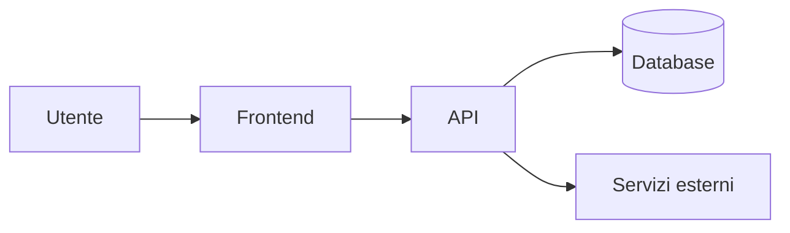

# Architettura

<!-- Fase 7 della guida. Ogni scelta tecnologica è una decisione nel registro. -->

## Scelte tecnologiche
| Ambito | Scelta | Decisione |
|---|---|---|
| Frontend | | DEC-00 |
| Backend | | DEC-00 |
| Database | | DEC-00 |
| Hosting | | DEC-00 |

## Schema generale

## Sicurezza
- **Autenticazione:** 
- **Autorizzazione per ruolo:** 
- **Protezione dei dati sensibili:** 

## Integrazioni
| Sistema esterno | Cosa si scambia | Se non risponde | Duplicati |
|---|---|---|---|
| | | | |
