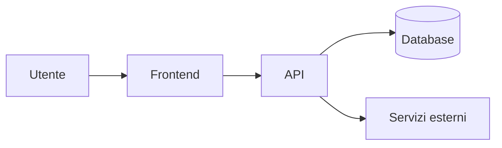

# Architettura

<!-- Fase 7 della guida. Ogni scelta tecnologica è una decisione nel registro. -->

## Scelte tecnologiche
| Ambito | Scelta | Decisione |
|---|---|---|
| App desktop (Windows, macOS) | Tauri 2: interfaccia web in TypeScript, parte nativa in Rust. Framework dell'interfaccia da scegliere | DEC-23 |
| Server (API) | Node con TypeScript. Framework da scegliere | DEC-24 |
| Archivio del server | File system: documenti e immagini cifrati come file | DEC-25 |
| Database sul dispositivo | Da scegliere (rinvio) | — |
| Hosting | Da scegliere (rinvio); deve avere un disco persistente (DEC-25) | — |

## Schema generale

## Sicurezza
- **Autenticazione:** 
- **Autorizzazione per ruolo:** 
- **Protezione dei dati sensibili:** 

## Integrazioni
| Sistema esterno | Cosa si scambia | Se non risponde | Duplicati |
|---|---|---|---|
| | | | |
