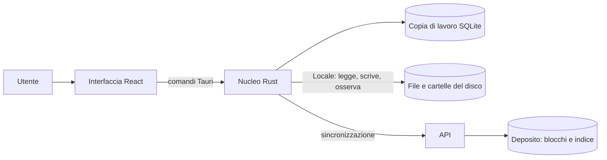

# Architettura

<!-- Fase 7 della guida. Ogni scelta tecnologica è una decisione nel registro. -->

## Scelte tecnologiche
| Ambito | Scelta | Decisione |
|---|---|---|
| App desktop (Windows, macOS) | Tauri 2: interfaccia web in TypeScript, parte nativa in Rust | DEC-23 |
| Interfaccia | React con TypeScript | DEC-26 |
| Editor della nota | CodeMirror 6. Per ora testo puro: l'anteprima dal vivo del markdown è sospesa | DEC-27, DEC-64 |
| Barra di scorrimento | OverlayScrollbars (`overlayscrollbars`, `overlayscrollbars-react`) per la barra sottile sovrapposta al contenuto (CMP-25) | DEC-89 |
| Icone e carattere | `lucide-react` per le icone Lucide; Inter incorporato nell'app con `@fontsource-variable/inter`, così non dipende dai caratteri installati | DEC-15, tokens.md |
| Token nel codice | Variabili CSS in `client/src/stili/token.css`, stili di testo come classi in `client/src/stili/base.css`; il modo chiaro o scuro segue il sistema | DEC-21, DEC-22 |
| Server (API) | Node con TypeScript e Fastify | DEC-24, DEC-32 |
| Archivio del server | PostgreSQL: Neon in rete, PGlite (Postgres nel processo) in locale e nelle prove; blocchi cifrati sul dispositivo (DEC-121; oggi ancora in chiaro, DEC-78) | DEC-105 |
| Copia di lavoro nel client | Note, tag, cartelle e cestino in un database SQLite nel nucleo Rust del client (rusqlite), file `copia-di-lavoro.db` nella cartella dei dati delle applicazioni; l'interfaccia lo legge e scrive con comandi Tauri, uno per endpoint descritto in `api.md`, con gli stessi dati e codici di errore. Il client funziona senza API. Alla prima apertura parte da una copia di `memodu.db` dell'API, se c'è nella stessa cartella | DEC-67 (proposta) |
| Server (deposito della sincronizzazione) | L'API non gestisce più le note: conserva solo i blocchi della sincronizzazione e le loro versioni (DEC-75, DEC-85); conosce solo i dati dell'utente fisso che non permettono di leggere le note (DEC-121) | DEC-85 |
| File locali (RF-17) | Nel nucleo Rust (`locale.rs`): `tauri-plugin-dialog` per scegliere la cartella, `notify` per i cambi sul disco, `sha2` per l'impronta, `encoding_rs` per Windows-1252, `trash` per il Cestino del sistema; niente va sul server | DEC-118 |
| Hosting | Vercel, funzione con Fastify senza configurazione, solo HTTPS; regione Francoforte | DEC-104, DEC-105 |

## Struttura del repository
Un solo repository con workspace npm (DEC-33); client e API si avviano separatamente (DEC-67):

| Cartella | Contenuto |
|---|---|
| `client` | App desktop: interfaccia React in `src`, nucleo Rust di Tauri in `src-tauri` con la copia di lavoro (DEC-67). Si avvia con `npm run client` |
| `api` | API in Fastify. Si avvia da sola con `npm run api` |
| `condiviso` | Tipi dei dati dei comandi del nucleo (per esempio la Nota) e limite delle note, per l'interfaccia. Il server non lo usa mentre gira: su Vercel non può importare sorgenti TypeScript di un altro pacchetto, quindi indirizzo e limiti del server stanno in `api/src/costanti.ts` (DEC-105) |

Prove con Vitest, controllo del codice con ESLint e Prettier.

## Schema del database (DEC-48)
SQLite nella copia di lavoro del client (DEC-67, DEC-85; prima nell'API, DEC-46, DEC-47). Qui le tabelle di Must A, B e C; sincronizzazione (schema 2), impostazioni (schema 3 e 4) e indice di ricerca (schema 5, sotto) hanno le loro sezioni; immagini e avvisi arrivano con i loro frammenti.

| Tabella | Colonne principali | Regole |
|---|---|---|
| `note` | id, titolo, contenuto (markdown), cartella, creata, creata scelta, modificata, fine validità, eliminata il, provenienza | Una sola cartella o nessuna (RF-05); nel cestino se «eliminata il» è compilato (DEC-37) |
| `cartelle` | id, nome, chiave del nome, cartella madre, eliminata il, provenienza | Nome unico tra le sorelle senza maiuscole (RB-23); nel cestino con tutto il contenuto (RB-25) |
| `tag` | id, nome come scritto la prima volta, chiave del nome, tag padre | Unico senza maiuscole (RB-22); un livello per tag (RB-18); i sotto-tag seguono il padre (RB-19) |
| `note_tag` | nota, tag | Un tag può restare senza note (RB-49) |

- La chiave del nome è il nome in minuscolo calcolato dal nucleo, perché il confronto di SQLite ignora le maiuscole solo senza accenti.
- Istanti in ora universale ISO 8601, date del calendario come giorno. La versione dello schema è segnata nel database.

## Indice di ricerca (RF-08, DEC-94, DEC-95)
- **Dove:** schema 5 della copia di lavoro (lo schema 4 aggiunge l'impostazione), tabella virtuale FTS5 `ricerca` con il tokenizzatore `trigram remove_diacritics 1` (SQLite 3.50, incluso in rusqlite con FTS5). Colonne: `id` della nota (non indicizzata), `titolo`, `contenuto`, `tag` (i percorsi completi dei tag della nota, separati da a capo).
- **Aggiornamento:** trigger su `note`, `note_tag` e `tag`, che valgono anche per le modifiche ricevute dalla sincronizzazione (compresa l'unione di due tag doppi); la tabella `ricerca_righe` lega ogni nota alla sua riga dell'indice, così un salvataggio non scorre tutto l'indice; il trigger sui tag scatta solo se nome o padre cambiano davvero; i percorsi li dà la funzione SQL `tag_della_nota`, registrata da Rust. Alla migrazione l'indice si riempie con le note che ci sono.
- **Ricerca:** dalla terza lettera l'indice, con ogni parola tra virgolette (il testo non è mai una query, RB-08); con una o due lettere si scorrono le note con la funzione SQL `normalizza` (minuscole, senza accenti). Filtri, ordine ed estratto in Rust (`client/src-tauri/src/archivio_ricerca.rs`).
- **Impostazione:** colonna `cestino_in_ricerca` della tabella `impostazioni`, sincronizzata (RB-52).

## Regole dei dati (frammento Must D, DEC-49)
Le regole stanno solo nella copia di lavoro del client (`client/src-tauri/src/archivio.rs`, file `copia-di-lavoro.db`, DEC-67, DEC-85): l'API non ha più un archivio delle note. Nella copia di lavoro ogni operazione è una transazione.

- **Nomi delle cartelle** (RB-63): i caratteri vietati nei nomi dei file (`< > : " / \ | ? *` e i caratteri di controllo) diventano `-`, senza punti e spazi finali, al massimo 100 caratteri; i nomi riservati di Windows (`CON`, `PRN`, `AUX`, `NUL`, `COM1`…, `LPT1`…) ricevono un `-` in fondo. Maiuscole e minuscole non contano (RB-23). Confermato da Manuel Cucca il 28/09/2026.
- **Titoli delle note:** si ripetono liberamente (RB-16); non servono più numeri per distinguere i file.
- **Anteprima nell'elenco** (RB-15): le prime parole del contenuto senza simboli markdown, al massimo 80 caratteri. Confermato da Manuel Cucca il 28/09/2026.
- **Cestino** (DEC-37, DEC-48): eliminare segna «eliminata il» sulla nota o sulla cartella; una cartella eliminata porta con sé tutto il contenuto, che non si apre più finché non torna. Ripristinare la riporta nella radice (RB-28); eliminare per sempre cancella la riga e, per una cartella, tutto il contenuto, tranne gli elementi eliminati a parte, che restano nel cestino. Quando un'unione svuota una cartella, la cartella sparisce anche se nel cestino ci sono elementi che venivano da lì: si staccano e restano ripristinabili nella radice.
- **Riconnessione:** ogni operazione dell'archivio passa da un'unica funzione (`con_riconnessione`): se SQLite risponde che il file è in sola lettura, la connessione si riapre e l'operazione si riprova una volta, così quando il file torna scrivibile non serve riavviare l'app. Scelta di Manuel Cucca il 29/09/2026.
- **Dove:** la cartella dei dati delle applicazioni (DEC-46); la variabile d'ambiente `MEMODU_CARTELLA` la sostituisce (prove e sviluppo).

## Sincronizzazione (RF-10, Fase 7 completa, codice del 30/09/2026)
- **Codice:** server in `api/src/sincronizzazione.ts`; client in `client/src-tauri/src/sincronizzazione.rs` (il filo in background) e `archivio_sinc.rs` (blocchi, fusione e conflitti); schema 2 della copia di lavoro con i trigger che segnano gli elementi modificati. Se una modifica ricevuta cambia la nota aperta mentre la finestra ha ancora il testo vecchio, il testo della finestra va in una copia in conflitto e non la sovrascrive (DEC-06).
- **Unità:** un blocco per elemento (nota, cartella, tag, impostazioni; gli avvisi restano sul dispositivo, DEC-90, DEC-91), con dentro i suoi collegamenti; il server conosce solo identificativo, versione, dimensione e ora, e tiene anche le versioni precedenti di ogni blocco. Confronti e conflitti li risolve il client (DEC-75).
- **Modifiche e conflitti:** versione per blocco e numero d'ordine globale sul server; il dispositivo tiene la base di ogni elemento e confronta campo per campo; nei conflitti di RB-36 … RB-38 vince la modifica arrivata per ultima al server, cioè quella del dispositivo che fonde (DEC-109); le eliminazioni definitive diventano blocchi «eliminato» (DEC-76).
- **Versioni precedenti:** a scalare per 7 giorni (tutte nell'ultima ora, una all'ora nell'ultimo giorno, una al giorno fino a 7); la versione attuale resta sempre (DEC-77, DEC-113).
- **Cifratura (DEC-121, nucleo fatto il 06/10/2026):** il nucleo cifra ogni blocco con la chiave dati, XChaCha20-Poly1305 con un nonce casuale di 192 bit (crate `chacha20poly1305`) e l'id dell'elemento come dati aggiunti; il server vede solo blocchi illeggibili. Al primo accesso si rimanda tutto cifrato e il server cancella le versioni in chiaro (DEC-78, condizione 3). Dettagli in `architettura/api.md`.
- **Accesso (DEC-121):** vedi Sicurezza. Senza un gettone valido si lavora in locale e la finestra non si blocca (RB-87). Server fatto il 06/10/2026 (`api/src/accesso.ts`, `chiavi.ts`, `xchacha.ts`, `rotteAccesso.ts`, `utente.ts`); nucleo e interfaccia fatti lo stesso giorno (`client/src-tauri/src/accesso.rs`, `cifratura.rs`; `client/src/componenti/ModuloAccesso.tsx`, il box dell'account in `BoxAccount.tsx` con DEC-122, l'avviso in `FinestraPrincipale.tsx`). Il gettone statico del file `credenziali` delle app fino alla 0.1.8 (DEC-79, DEC-104) è stato tolto dal server il 07/10/2026: vale solo il JWT.
- **Server cambiato:** l'archivio del server ha un identificativo; se cambia, il client azzera versioni e numero d'ordine e rimanda tutto (`azzera_sinc`, DEC-105).
- **Quando:** all'avvio, qualche secondo dopo ogni salvataggio, ogni 30 s e al ritorno della rete; senza rete i tentativi si diradano da 5 s fino a 5 minuti (DEC-80).
- **Avviso:** «server irraggiungibile» dopo un'ora senza sincronizzazioni riuscite (RB-40, DEC-112).
- **Versioni di app e server:** ogni richiesta porta la versione del protocollo; se incompatibile, avviso «errore di sincronizzazione» e si continua sulla copia di lavoro (DEC-83).

## Schema generale

```mermaid
flowchart LR
    U[Utente] --> F[Interfaccia React]
    F -- comandi Tauri --> N[Nucleo Rust]
    N --> C[(Copia di lavoro SQLite)]
    N -- Locale: legge, scrive, osserva --> L[(File e cartelle del disco)]
    N -- sincronizzazione --> A[API]
    A --> D[(Deposito: blocchi e indice)]
```

## Sicurezza
- **Autenticazione (DEC-121):** un solo utente, per ora fisso. Sul dispositivo Argon2id(password, sale) con 64 MiB, 3 passaggi e 1 filo (crate `argon2`); dal risultato HKDF-SHA256 (crate `hkdf`) ricava la prova di accesso, che va al server, e la chiave della cassaforte, che non lascia il dispositivo. Il server confronta l'impronta SHA-256 della prova e restituisce un JWT HS256 firmato con un segreto suo (`node:crypto`, nessuna libreria). Architettura temporanea: un JWT di 30 giorni, rinnovato dall'app quando ne mancano meno di 7, e i dati dell'utente nelle variabili d'ambiente. Architettura finale: JWT di 15 minuti, gettone di rinnovo opaco di 90 giorni ruotato a ogni uso e revocabile, e i dati dell'utente in una tabella. Nessun limite ai tentativi, per ora.
- **Autorizzazione per ruolo:** nessun ruolo: un solo utente (DEC-13).
- **Protezione dei dati sensibili:** cifratura end-to-end (DEC-08, DEC-121): le note si cifrano con una chiave dati casuale, che sul server sta solo avvolta due volte, con la chiave della cassaforte e con quella ricavata dalla chiave di recupero (RB-90). Sul dispositivo gettone e chiave dati stanno nel portachiavi del sistema (crate `keyring`); la copia di lavoro sul disco resta in chiaro (rischio accettato).
- **File locali (DEC-118):** i comandi di Locale accettano solo percorsi dentro le cartelle che l'utente ha aggiunto; il nucleo risolve il percorso vero (anche dietro un collegamento simbolico) e rifiuta quelli che escono. L'elenco e le modifiche in sospeso restano nella copia di lavoro di questo computer.

## Integrazioni
| Sistema esterno | Cosa si scambia | Se non risponde | Duplicati |
|---|---|---|---|
| | | | |
