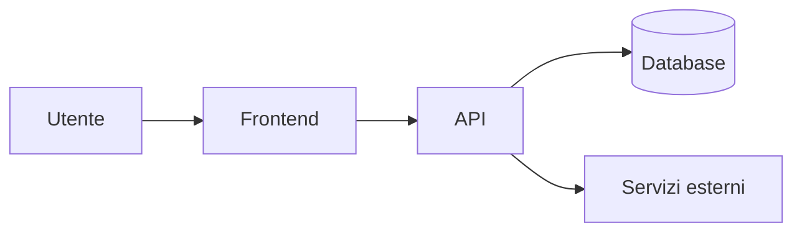

# Architettura

<!-- Fase 7 della guida. Ogni scelta tecnologica è una decisione nel registro. -->

## Scelte tecnologiche
| Ambito | Scelta | Decisione |
|---|---|---|
| App desktop (Windows, macOS) | Tauri 2: interfaccia web in TypeScript, parte nativa in Rust. Framework dell'interfaccia da scegliere | DEC-23 |
| Interfaccia | React con TypeScript | DEC-26 |
| Editor della nota | CodeMirror 6 con anteprima dal vivo | DEC-27 |
| Icone e carattere | `lucide-react` per le icone Lucide; Inter incorporato nell'app con `@fontsource-variable/inter`, così non dipende dai caratteri installati | DEC-15, tokens.md |
| Token nel codice | Variabili CSS in `app/src/stili/token.css`, stili di testo come classi in `app/src/stili/base.css`; il modo chiaro o scuro segue il sistema | DEC-21, DEC-22 |
| Server (API) | Node con TypeScript e Fastify | DEC-24, DEC-32 |
| Archivio del server | File system: documenti e immagini cifrati come file | DEC-25 |
| Note | Le gestisce l'API (DEC-30). Note, tag, cartelle e cestino in un database SQLite nell'API; il testo resta markdown in una colonna. Il file del database sta nella cartella dei dati delle applicazioni (`%LOCALAPPDATA%\Memodu` su Windows, `~/Library/Application Support/Memodu` su macOS), fuori da OneDrive e iCloud; su Windows la cartella locale e non quella «Roaming», che nei domini aziendali può seguire il profilo sul server; per le prove la variabile `MEMODU_CARTELLA` lo sposta (scelte di Manuel Cucca il 29/09/2026). Dal frammento Must D (DEC-49) il codice scrive nel database. Poi la copia di lavoro sul dispositivo | DEC-30, DEC-45, DEC-46, DEC-47 |
| Hosting | Per ora la macchina di sviluppo (ambiente Locale). L'hosting definitivo è rinviato; deve avere un disco persistente (DEC-25) | — |

## Struttura del repository
Un solo repository con workspace npm (DEC-33):

| Cartella | Contenuto |
|---|---|
| `app` | App desktop: interfaccia React in `src`, nucleo Rust di Tauri in `src-tauri` |
| `server` | API in Fastify |
| `condiviso` | Tipi dei dati usati da app e server (per esempio la Nota dell'API) e indirizzo dell'API |

Prove con Vitest, controllo del codice con ESLint e Prettier.

## Schema del database (DEC-48)
SQLite nell'API (DEC-46, DEC-47). Solo ciò che serve a Must A, B e C; immagini, avvisi, impostazioni e indice di ricerca arrivano con i loro frammenti.

| Tabella | Colonne principali | Regole |
|---|---|---|
| `note` | id, titolo, contenuto (markdown), cartella, creata, creata scelta, modificata, fine validità, eliminata il, provenienza | Una sola cartella o nessuna (RF-05); nel cestino se «eliminata il» è compilato (DEC-37) |
| `cartelle` | id, nome, chiave del nome, cartella madre, eliminata il, provenienza | Nome unico tra le sorelle senza maiuscole (RB-23); nel cestino con tutto il contenuto (RB-25) |
| `tag` | id, nome come scritto la prima volta, chiave del nome, tag padre | Unico senza maiuscole (RB-22); un livello per tag (RB-18); i sotto-tag seguono il padre (RB-19) |
| `note_tag` | nota, tag | Un tag può restare senza note (RB-49) |

- La chiave del nome è il nome in minuscolo calcolato dall'API, perché il confronto di SQLite ignora le maiuscole solo senza accenti.
- Istanti in ora universale ISO 8601, date del calendario come giorno. La versione dello schema è segnata nel database.

## Regole dei dati (frammento Must D, DEC-49)
I dati li scrive solo l'API (`server/src/archivio.ts`), nel file `memodu.db`.

- **Nomi delle cartelle** (RB-63): i caratteri vietati nei nomi dei file (`< > : " / \ | ? *` e i caratteri di controllo) diventano `-`, senza punti e spazi finali, al massimo 100 caratteri; i nomi riservati di Windows (`CON`, `PRN`, `AUX`, `NUL`, `COM1`…, `LPT1`…) ricevono un `-` in fondo. Maiuscole e minuscole non contano (RB-23). Confermato da Manuel Cucca il 28/09/2026.
- **Titoli delle note:** si ripetono liberamente (RB-16); non servono più numeri per distinguere i file.
- **Anteprima nell'elenco** (RB-15): le prime parole del contenuto senza simboli markdown, al massimo 80 caratteri. Confermato da Manuel Cucca il 28/09/2026.
- **Cestino** (DEC-37, DEC-48): eliminare segna «eliminata il» sulla nota o sulla cartella; una cartella eliminata porta con sé tutto il contenuto, che non si apre più finché non torna. Ripristinare la riporta nella radice (RB-28); eliminare per sempre cancella la riga e, per una cartella, tutto il contenuto, tranne gli elementi eliminati a parte, che restano nel cestino.
- **Dove:** la cartella dei dati delle applicazioni (DEC-46); la variabile d'ambiente `MEMODU_CARTELLA` la sostituisce (prove e sviluppo).

## Schema generale

```mermaid
flowchart LR
    U[Utente] --> F[Frontend]
    F --> A[API]
    A --> D[(Database)]
    A --> E[Servizi esterni]
```

## Sicurezza
- **Autenticazione:** 
- **Autorizzazione per ruolo:** 
- **Protezione dei dati sensibili:** 

## Integrazioni
| Sistema esterno | Cosa si scambia | Se non risponde | Duplicati |
|---|---|---|---|
| | | | |
