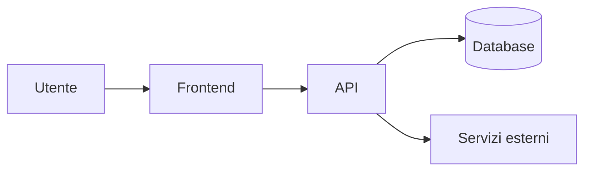

# Architettura

<!-- Fase 7 della guida. Ogni scelta tecnologica è una decisione nel registro. -->

## Scelte tecnologiche
| Ambito | Scelta | Decisione |
|---|---|---|
| App desktop (Windows, macOS) | Tauri 2: interfaccia web in TypeScript, parte nativa in Rust. Framework dell'interfaccia da scegliere | DEC-23 |
| Interfaccia | React con TypeScript | DEC-26 |
| Editor della nota | CodeMirror 6 con anteprima dal vivo | DEC-27 |
| Icone e carattere | `lucide-react` per le icone Lucide; Inter incorporato nell'app con `@fontsource-variable/inter`, così non dipende dai caratteri installati | DEC-15, tokens.md |
| Token nel codice | Variabili CSS in `app/src/stili/token.css`, stili di testo come classi in `app/src/stili/base.css`; il modo chiaro o scuro segue il sistema | DEC-21, DEC-22 |
| Server (API) | Node con TypeScript e Fastify | DEC-24, DEC-32 |
| Archivio del server | File system: documenti e immagini cifrati come file | DEC-25 |
| Note | Per ora le gestisce l'API: file markdown in `Documenti\Memodu` sulla macchina di sviluppo (intestazione YAML, titolo come prima riga, date in UTC o solo giorno). Provvisorio: poi database e copia di lavoro sul dispositivo | DEC-28, DEC-29, DEC-30 |
| Hosting | Per ora la macchina di sviluppo (ambiente Locale). L'hosting definitivo è rinviato; deve avere un disco persistente (DEC-25) | — |

## Struttura del repository
Un solo repository con workspace npm (DEC-33):

| Cartella | Contenuto |
|---|---|
| `app` | App desktop: interfaccia React in `src`, nucleo Rust di Tauri in `src-tauri` |
| `server` | API in Fastify |
| `condiviso` | Tipi dei dati usati da app e server (per esempio la Nota dell'API) e indirizzo dell'API |

Prove con Vitest, controllo del codice con ESLint e Prettier.

## File delle note (frammento Must A)
Li scrive solo l'API (`server/src/archivio.ts`), secondo DEC-28 e DEC-29:

```
---
id: 3f6c1b2e-9a4d-4c8e-8f1a-2b7d5e6a9c10
creata: 2026-09-28T08:00:00.000Z
modificata: 2026-09-28T08:40:12.000Z
---
# Titolo

Contenuto in markdown
```

- La riga `# Titolo` c'è sempre, anche vuota (`# `), così un contenuto che inizia con un titolo non si confonde con il titolo della nota.
- Nome del file: il titolo con i caratteri vietati (`< > : " / \ | ? *` e i caratteri di controllo) sostituiti da `-`, senza punti e spazi finali, al massimo 100 caratteri; i nomi riservati di Windows (`CON`, `PRN`, `AUX`, `NUL`, `COM1`…, `LPT1`…) ricevono un `-` in fondo. Titolo vuoto: "Senza titolo". Nome già usato, senza distinguere maiuscole e minuscole: "Titolo 2", "Titolo 3"… Confermato da Manuel Cucca il 28/09/2026.
- Anteprima nell'elenco (RB-15): le prime parole del contenuto senza simboli markdown, al massimo 80 caratteri. Confermato da Manuel Cucca il 28/09/2026.
- I file `.md` senza questa intestazione non sono note di Memodu e si ignorano.
- La cartella è `Documenti/Memodu`; la variabile d'ambiente `MEMODU_CARTELLA` la sostituisce (prove e sviluppo).
- **Cartelle** (frammento Must B, DEC-36, provvisorio): ogni cartella di Memodu è una sottocartella vera di `Documenti/Memodu`, con lo stesso nome; le note stanno nella sottocartella della loro cartella, le non organizzate direttamente in `Documenti/Memodu`. Il nome segue le regole dei nomi dei file qui sopra (RB-63); maiuscole e minuscole non contano (RB-23).
- **Cestino** (DEC-36, DEC-37): una cartella nascosta `.cestino` dentro `Documenti/Memodu`, con una sottocartella per elemento (`.cestino/<id>/`) che contiene la nota o la cartella e il file `elemento.json` con tipo, nome, provenienza e data di eliminazione. Eliminare sposta lì la nota o la cartella con tutto il contenuto; ripristinare la riporta nella radice (RB-28); svuotare o eliminare per sempre cancella da lì. La `.cestino` non compare mai come cartella nell'albero. Scelta di Manuel Cucca il 28/09/2026, al posto del cestino del sistema, che il sistema può svuotare senza Memodu.

## Schema generale

```mermaid
flowchart LR
    U[Utente] --> F[Frontend]
    F --> A[API]
    A --> D[(Database)]
    A --> E[Servizi esterni]
```

## Sicurezza
- **Autenticazione:** 
- **Autorizzazione per ruolo:** 
- **Protezione dei dati sensibili:** 

## Integrazioni
| Sistema esterno | Cosa si scambia | Se non risponde | Duplicati |
|---|---|---|---|
| | | | |
