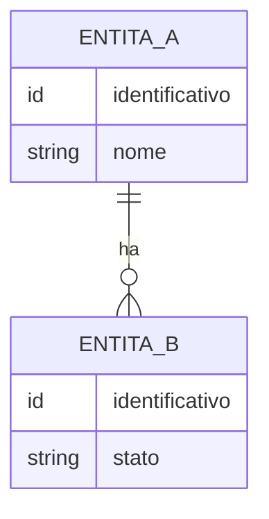

# Interfaccia – Entità

<!-- Fase 3 della guida. -->

## Diagramma ER

## EN-00 – [Nome entità]
**Descrizione:** 

| Attributo | Tipo | Obbligatorio | Vincoli | Note |
|---|---|---|---|---|
| | | | | |

- **Chi la crea:** 
- **Chi la modifica:** 
- **Cancellazione:** definitiva | archiviazione
- **Dati sensibili:** [quali attributi, chi può vederli, per quanto tempo si conservano]
