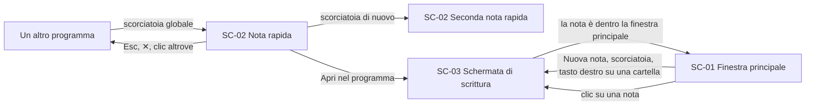

# Interfaccia – Schermate

<!-- Fasi 4 e 6 della guida. Wireframe e mockup restano nello strumento di design: qui si mettono i link. -->

Impostazione generale della Fase 4: **desktop-first**. Il pubblico della prima fase usa Windows, macOS e web su schermo grande (DEC-04) e la nota rapida esiste solo su desktop (RF-01): la versione stretta si ricava da quella larga, non il contrario.

| Breakpoint | Larghezza | Cosa cambia |
|---|---|---|
| Largo | ≥ 1280 px | Tre zone affiancate: colonna sinistra, nota aperta, spazio di respiro ai lati del testo |
| Medio | 1024–1279 px | Colonna sinistra più stretta; il testo della nota occupa tutta la larghezza restante |
| Stretto | < 1024 px (solo web) | La colonna sinistra si chiude; il pulsante ☰ in alto a sinistra la riapre come drawer sopra il contenuto, con velo (livello 30). Clic sul velo o Esc per chiuderla. [Colonna chiusa](https://www.figma.com/design/ioeRDMTxu3TEMoLN8rinAK/Memodu--Wireframe--Fase-4-?node-id=32-252) · [drawer aperto](https://www.figma.com/design/ioeRDMTxu3TEMoLN8rinAK/Memodu--Wireframe--Fase-4-?node-id=32-274), `immagini/SC-01-stretto.png`, `immagini/SC-01-stretto-drawer.png` |

## SC-01 – Finestra principale
**Flussi:** FL-01 · FL-02 · FL-05 · FL-06 · FL-09 · **Componenti:** vedi "Inventario dei componenti concettuali"

- **Wireframe:** [stato pieno](https://www.figma.com/design/ioeRDMTxu3TEMoLN8rinAK/Memodu--Wireframe--Fase-4-?node-id=7-2) · [stato vuoto](https://www.figma.com/design/ioeRDMTxu3TEMoLN8rinAK/Memodu--Wireframe--Fase-4-?node-id=7-56) · [risultati di ricerca](https://www.figma.com/design/ioeRDMTxu3TEMoLN8rinAK/Memodu--Wireframe--Fase-4-?node-id=14-2) · [finestra di conferma e avviso](https://www.figma.com/design/ioeRDMTxu3TEMoLN8rinAK/Memodu--Wireframe--Fase-4-?node-id=14-91) · [non organizzate chiuse](https://www.figma.com/design/ioeRDMTxu3TEMoLN8rinAK/Memodu--Wireframe--Fase-4-?node-id=21-2) · [menu della nota aperto](https://www.figma.com/design/ioeRDMTxu3TEMoLN8rinAK/Memodu--Wireframe--Fase-4-?node-id=22-3) · [tasto destro su una cartella](https://www.figma.com/design/ioeRDMTxu3TEMoLN8rinAK/Memodu--Wireframe--Fase-4-?node-id=30-186)
- **Esportazioni:** `immagini/SC-01.png`, `immagini/SC-01-vuoto.png`, `immagini/SC-01-ricerca.png`, `immagini/SC-01-conferma.png`, `immagini/SC-01-sezione-chiusa.png`, `immagini/SC-01-menu.png`, `immagini/SC-01-tasto-destro-cartella.png`
- **Mockup:** [Fase 6]

La finestra è sempre la stessa: cambia solo cosa c'è dentro l'area della nota. Il programma mostra una nota alla volta (RF-01), quindi non esistono schede né più note affiancate (RF-12 è *Should*, fuori dalla prima fase).

### Zone e gerarchia
| Ordine di lettura | Zona | Contenuto |
|---|---|---|
| 1 | Area della nota (centro-destra) | La nota aperta: SC-03. È la zona più grande e la prima che si nota: aprire e scrivere viene prima di tutto (RNF-01) |
| 2 | Colonna sinistra, in cima | Ricerca (FL-06) |
| 3 | Colonna sinistra, sezione **Non organizzate** | Le note nella radice (RF-05), in cima, una riga ciascuna con il solo titolo: sono quelle appena scritte, ed è da qui che si trascinano nell'albero. Il **+** accanto al titolo della sezione crea una nuova nota (FL-09) |
| 4 | Colonna sinistra, sezione **Cartelle** | Albero delle cartelle, sotto, con il pulsante **+** in cima alla sezione (FL-05) |

Nessuna barra superiore: la colonna sinistra e l'area della nota occupano tutta l'altezza della finestra, divise da una sola linea verticale. Nessun pulsante Nuova nota in evidenza: si crea dal + delle non organizzate, dalla scorciatoia o dal tasto destro su una cartella.

La colonna sinistra ha due sezioni impilate senza separatore: le cartelle iniziano subito sotto l'ultima nota non organizzata e la colonna scorre tutta insieme.

**Le due sezioni si chiudono** con un clic sul titolo (▾ aperta, ▸ chiusa), così molte non organizzate non spingono le cartelle in fondo. Chiusa, la sezione Non organizzate mostra quante note contiene.

Le **non organizzate stanno sopra le cartelle**: sono la posta in arrivo della scrittura veloce (RB-01), quindi la lista che si guarda più spesso, e il trascinamento verso l'albero va dall'alto verso il basso.

**Il Cestino non è nella colonna sinistra** (FL-05, RB-27, RB-28): la colonna resta la sola cosa che serve mentre si scrive. Si raggiunge dal menu `···` in alto a destra (vedi sotto).

### Menu `···` in alto a destra (livello 20)
L'unico menu della finestra. È diviso in due parti:

| Parte | Voci |
|---|---|
| Sopra: **questa nota** | Tag, Date, Sposta in, Elimina (FL-04, RB-25) |
| Sotto: **Memodu** | Cestino, Impostazioni (scorciatoia globale EN-07, cestino nella ricerca RB-29), Account e sincronizzazione |

Senza una nota aperta (stato vuoto) il menu mostra solo la parte sotto.

### Tasto destro su una cartella (livello 20)
Nuova nota qui (la nota nasce in quella cartella, RB-09), Nuova sottocartella, Rinomina, Elimina (nel cestino con il contenuto, RB-25, RB-26).

### Risultati di ricerca (livello 20)
La card si apre sotto la ricerca ed è più larga della colonna: copre l'area della nota senza velo, perché non blocca niente. In cima ci sono i filtri (tag e le tre date dei metadati, FL-06). Ogni risultato mostra il titolo, il punto del testo in cui compare la parola cercata, la cartella e la data. Le note nel cestino sono attenuate e hanno l'etichetta "nel cestino" (RB-29).

### Finestre di conferma (livello 40)
Sono al centro della finestra, con un velo sul resto. L'azione principale sta a destra, Annulla a sinistra. L'esempio disegnato è il nome di cartella già presente (RB-31). Un avviso di livello 50 resta visibile sopra il velo.

### Stati della schermata
| Stato | Descrizione | Testo mostrato |
|---|---|---|
| Vuoto | Nessuna nota e nessuna cartella (primo utilizzo): l'area della nota mostra l'invito a scrivere e il pulsante per creare la prima nota; le non organizzate sono vuote | Testo definitivo in Fase 6 |
| Vuoto (albero) | Albero senza cartelle: si mostra solo la radice | **Rinviato**: aspetto definito nel giro di Fase 4 del modulo organizzazione (SF-16) |
| Caricamento | Solo al primo accesso su un dispositivo, mentre arriva la copia di lavoro: l'ossatura resta, le liste e la nota mostrano segnaposto ([wireframe](https://www.figma.com/design/ioeRDMTxu3TEMoLN8rinAK/Memodu--Wireframe--Fase-4-?node-id=32-192), `immagini/SC-01-caricamento.png`) | Nessun messaggio |
| Errore | Avviso di sincronizzazione in cima all'area della nota, non bloccante (RB-40) | Testo definitivo in Fase 6 |
| Successo | Non previsto: la sincronizzazione riuscita è invisibile (RB-40) | — |
| Contenuto lungo | Albero profondo o molte non organizzate: la colonna scorre tutta insieme, la ricerca resta fissa (livello 10) | — |

### Messaggi di errore
| Sfiga | Testo definitivo |
|---|---|
| SF-30 Server irraggiungibile oltre la soglia | Fase 6 (RB-40) |
| SF-25 Accesso scaduto o revocato | Fase 6 (RB-40) |
| SF-32 Errore di sincronizzazione | Fase 6 (RB-40) |

---

## Scala dei livelli di profondità (z-index)
Vale per tutto il progetto. Non si usano numeri fuori da questa scala.

- **Wireframe:** [scala esplosa](https://www.figma.com/design/ioeRDMTxu3TEMoLN8rinAK/Memodu--Wireframe--Fase-4-?node-id=14-160) · [esempi concreti per livello](https://www.figma.com/design/ioeRDMTxu3TEMoLN8rinAK/Memodu--Wireframe--Fase-4-?node-id=31-100) · **Esportazioni:** `immagini/scala-z-index.png`, `immagini/scala-z-index-esempi.png`

| Livello | Uso |
|---|---|
| 0 | Contenuto base: colonna sinistra, area della nota |
| 10 | Elementi fissi: ricerca in cima alla colonna sinistra |
| 20 | Menu a discesa, menu del tasto destro, suggerimenti dei tag, card dei risultati di ricerca, pannello impostazioni dell'immagine, pillola degli strumenti, menu di inserimento |
| 30 | Overlay e drawer: colonna sinistra come drawer sul web stretto, area di trascinamento di un'immagine |
| 40 | Finestre di conferma (svuota cestino, elimina tag) |
| 50 | Avvisi (RB-40) |

Regole di comportamento:
- **Mai due finestre di conferma sovrapposte.** Finché una è aperta, i comandi che ne aprirebbero un'altra non rispondono.
- **Un avviso non viene mai coperto:** resta visibile anche sopra una finestra di conferma e non blocca l'interazione. Resta finché non viene visto (SF-31).
- **Sotto un drawer o una finestra di conferma** il contenuto resta visibile ma non si può usare; `Esc` chiude l'elemento più in alto.
- **Gli elementi di livello 20 si chiudono** al clic fuori, con `Esc` o quando il contenuto sotto scorre.
- **La finestra della nota rapida è una finestra di sistema:** sta fuori da questa scala e resta in primo piano rispetto agli altri programmi.

---

## Inventario dei componenti concettuali
Elementi che si ripetono, notati disegnando i wireframe. Sono l'ingresso della Fase 5, che assegnerà i codici `CMP-` e li disegnerà davvero.

| Componente | Scopo | Dove compare |
|---|---|---|
| Barra di ricerca | Cercare e filtrare, con la card dei risultati a discesa | SC-01 |
| Albero delle cartelle | Navigare, trascinare dentro, tasto destro | SC-01 |
| Riga di nota | Titolo o prime parole (RB-15); nelle non organizzate solo il titolo, nei risultati anche frase trovata, cartella e data | SC-01 |
| Editor markdown | Scrivere vedendo la formattazione (RF-02) | SC-02, SC-03 |
| Menu di inserimento | Inserire titoli, elenchi, checklist, immagini scrivendo `/` | SC-03 |
| Pillola degli strumenti | Una sola barra, sopra la selezione o il punto del clic: formattazione con testo selezionato, inserimento al clic sul vuoto | SC-03 |
| Menu del tasto destro | Stesse azioni della barra e dell'albero, senza spostarsi (RF-11) | SC-01, SC-03 |
| Campo di testo | Una riga di testo, con icona facoltativa a destra (es. calendario) | SC-03 |
| Pannello a comparsa | Contenitore di livello 20 sotto il `···`: date, sposta in | SC-03 |
| Date picker | Calendario per scegliere una data; si disegna in Fase 5 | SC-03 |
| Menu `···` | Sopra le azioni sulla nota aperta, sotto quelle del programma (cestino, impostazioni, account) | SC-01, SC-03 |
| Campo titolo | Titolo della nota, può restare vuoto (RB-15) | SC-03 |
| Immagine inline | Immagine nel testo, selezionabile, con il suo pannello impostazioni | SC-03 |
| Avviso | Comunicazione non bloccante che resta finché non è vista (RB-40) | Tutte |
| Finestra di conferma | Azioni non reversibili (svuota cestino, elimina tag) | SC-01 |
| Stato vuoto | Spiegazione più azione, al posto di una lista vuota | SC-01, SC-03 |
| Icona in background | Area di notifica (Windows) o barra dei menu (macOS): apre la nota rapida e il programma | Fuori dalle schermate |

---

## Wireflow – nucleo note (FL-01, FL-02, FL-09)
Ogni freccia è un'azione dell'utente o un evento del sistema.

`SC-03` non è una finestra a sé: vive dentro l'area della nota di `SC-01`. È una schermata separata perché ha stati propri, e perché la nota rapida ci arriva da fuori (RB-05).
