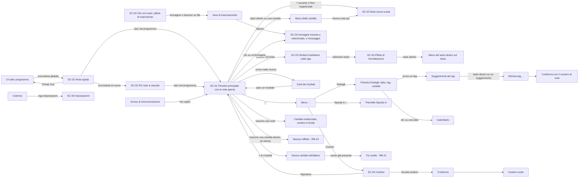

# Interfaccia – Schermate

<!-- Fasi 4 e 6 della guida. Wireframe e mockup restano nello strumento di design: qui si mettono i link. -->

Impostazione generale della Fase 4: **desktop-first**. Il pubblico della prima fase usa Windows e macOS su schermo grande (DEC-13) e la nota rapida esiste solo su desktop (RF-01): la versione stretta si ricava da quella larga, non il contrario.

| Breakpoint | Larghezza | Cosa cambia |
|---|---|---|
| Largo | ≥ 1280 px | Tre zone affiancate: colonna sinistra, nota aperta, spazio di respiro ai lati del testo |
| Medio | 1024–1279 px | Colonna sinistra più stretta; il testo della nota occupa tutta la larghezza restante |
| Stretto | < 1024 px (solo web, rinviato con ID-19) | La colonna sinistra si chiude; il pulsante ☰ in alto a sinistra la riapre come drawer sopra il contenuto, con velo (livello 30). Clic sul velo o Esc per chiuderla. [Colonna chiusa](https://www.figma.com/design/ioeRDMTxu3TEMoLN8rinAK/Memodu--Wireframe--Fase-4-?node-id=32-252) · [drawer aperto](https://www.figma.com/design/ioeRDMTxu3TEMoLN8rinAK/Memodu--Wireframe--Fase-4-?node-id=32-274), `immagini/SC-01-stretto.png`, `immagini/SC-01-stretto-drawer.png` |

## SC-01 – Finestra principale
**Flussi:** FL-01 · FL-02 · FL-05 · FL-06 · FL-09 · **Componenti:** vedi "Inventario dei componenti concettuali"

- **Foglio unico (DEC-55):** niente barra del programma. In alto a destra ··· e i pulsanti della finestra _ [] X (su Windows disegnati da Memodu, su macOS i tre pallini del sistema su una barra trasparente); la finestra si trascina dalla fascia in alto di 32 px, trasparente: il testo le scorre sotto, e ··· con _ [] X stanno in due pillole flottanti separate, 8 px l'una dall'altra, alte 32 con pulsanti tondi da 24, a 8 px dal bordo in alto e da destra (DEC-60, DEC-62, DEC-63), che per ora compare solo con il mouse entro 48 px dal bordo in alto ed entro 240 px dal bordo destro, così non compare insieme a «| →», oppure con il menu ··· aperto o con il focus (DEC-61, provvisorio; zona a destra proposta dall'agente). La colonna ha tre stati: **chiusa** (non si vede; con il mouse entro 48 px dal bordo sinistro, o con il focus, compare «| →» in alto a sinistra), **aperta** (sopra il foglio, con `ombra-flottante`; «← |» o un clic sul foglio la richiudono, scegliere una nota non la chiude, DEC-56) e **fissata** (con la puntina: resta aperta e il foglio si sposta a destra; Memodu lo ricorda). Aperta o fissata, si allarga o si stringe trascinando il bordo destro, da 10 px fino a lasciare 48 px al foglio; il margine resta 16 ai due lati e sono le righe a stringersi, con i titoli che finiscono con «…» (DEC-87); doppio clic per tornare a 288 (DEC-62). Disegni: [Proposta · Foglio unico](https://www.figma.com/design/18288YdcRf5vtWCtEefQYJ?node-id=70-1636).

- **Wireframe:** [stato pieno](https://www.figma.com/design/ioeRDMTxu3TEMoLN8rinAK/Memodu--Wireframe--Fase-4-?node-id=7-2) · [stato vuoto](https://www.figma.com/design/ioeRDMTxu3TEMoLN8rinAK/Memodu--Wireframe--Fase-4-?node-id=7-56) · [risultati di ricerca](https://www.figma.com/design/ioeRDMTxu3TEMoLN8rinAK/Memodu--Wireframe--Fase-4-?node-id=14-2) · [finestra di conferma e avviso](https://www.figma.com/design/ioeRDMTxu3TEMoLN8rinAK/Memodu--Wireframe--Fase-4-?node-id=14-91) · [non organizzate chiuse](https://www.figma.com/design/ioeRDMTxu3TEMoLN8rinAK/Memodu--Wireframe--Fase-4-?node-id=21-2) · [menu della nota aperto](https://www.figma.com/design/ioeRDMTxu3TEMoLN8rinAK/Memodu--Wireframe--Fase-4-?node-id=22-3) · [tasto destro su una cartella](https://www.figma.com/design/ioeRDMTxu3TEMoLN8rinAK/Memodu--Wireframe--Fase-4-?node-id=30-186)
- **Esportazioni:** `immagini/SC-01.png`, `immagini/SC-01-vuoto.png`, `immagini/SC-01-ricerca.png`, `immagini/SC-01-conferma.png`, `immagini/SC-01-sezione-chiusa.png`, `immagini/SC-01-menu.png`, `immagini/SC-01-tasto-destro-cartella.png`
- **Mockup:** [stato normale](https://www.figma.com/design/18288YdcRf5vtWCtEefQYJ?node-id=5-718) (in revisione)
- **Mockup della versione ridotta (frammento Must A, approvati da Manuel Cucca il 27/09/2026):** [con note](https://www.figma.com/design/18288YdcRf5vtWCtEefQYJ?node-id=17-214) · [vuota, primo utilizzo](https://www.figma.com/design/18288YdcRf5vtWCtEefQYJ?node-id=17-425); esportazioni `immagini/SC-01-ridotta-mockup.png`, `immagini/SC-01-ridotta-vuota-mockup.png`. Nella nota aperta niente menu `···` e niente riga dei metadati (tag e data di modifica): torna con RF-04
- **Mockup della versione per il frammento Must B «Smistare» (approvati da Manuel Cucca il 28/09/2026):** [con cartelle](https://www.figma.com/design/18288YdcRf5vtWCtEefQYJ?node-id=43-310) · [trascinamento](https://www.figma.com/design/18288YdcRf5vtWCtEefQYJ?node-id=44-1950) · [nuova cartella](https://www.figma.com/design/18288YdcRf5vtWCtEefQYJ?node-id=44-2027) · [nome già esistente](https://www.figma.com/design/18288YdcRf5vtWCtEefQYJ?node-id=44-2104) · [albero vuoto](https://www.figma.com/design/18288YdcRf5vtWCtEefQYJ?node-id=44-2942) · [errore](https://www.figma.com/design/18288YdcRf5vtWCtEefQYJ?node-id=44-3074) · [menu della nota](https://www.figma.com/design/18288YdcRf5vtWCtEefQYJ?node-id=44-3092) · [Sposta in](https://www.figma.com/design/18288YdcRf5vtWCtEefQYJ?node-id=44-3214); esportazioni `immagini/SC-01-smistare-*-mockup.png`. Il 30/09/2026 questi mockup e quelli di Must A sono stati aggiornati con il titolo nel percorso e senza metadati nel foglio (DEC-71), l'avviso 8 sotto la fascia (DEC-86), ed esportati di nuovo. Sempre il 30/09/2026 hanno la riga Impostazioni sotto il Cestino (DEC-91) e il ··· con la sua icona, ed esportati di nuovo.
- **Versione per il frammento Must B:** la colonna ha le sezioni Non organizzate e Cartelle, con l'albero (CMP-14); niente ricerca. La nota aperta non ha la riga dei tag e delle date. Il menu `···` in alto a destra ha solo «Sposta in…», «Elimina» e «Cestino» (DEC-36).
- **Versione ridotta per il frammento Must A:** la colonna sinistra ha solo la sezione Non organizzate con il suo + (FL-09); niente ricerca e niente sezione Cartelle. Le cartelle si aggiungeranno sotto con il frammento Must. Finché non ci sono le cartelle la sezione si intitola "Note" (diventerà "Non organizzate"); il + ha il suggerimento "Nuova nota"; con l'elenco vuoto compare "Le note che scrivi compaiono qui."

La finestra è sempre la stessa: cambia solo cosa c'è dentro l'area della nota. All'avvio, se ci sono note, si apre la modificata più di recente. Il programma mostra una nota alla volta (RF-01), quindi non esistono schede né più note affiancate (RF-12 è *Should*, fuori dalla prima fase).

### Zone e gerarchia
| Ordine di lettura | Zona | Contenuto |
|---|---|---|
| 1 | Area della nota (centro-destra) | La nota aperta: SC-03. È la zona più grande e la prima che si nota: aprire e scrivere viene prima di tutto (RNF-01) |
| 2 | Colonna sinistra, in cima | Ricerca (FL-06) |
| 3 | Colonna sinistra, sezione **Non organizzate** | Le note nella radice (RF-05), in cima, una riga ciascuna con il solo titolo, la modificata più di recente in cima (RB-60): sono quelle appena scritte, ed è da qui che si trascinano nell'albero. Il **+** accanto al titolo della sezione crea una nuova nota (FL-09) |
| 4 | Colonna sinistra, sezione **Cartelle** | Albero delle cartelle, sotto, con il pulsante **+** in cima alla sezione (FL-05). Aprendo una cartella compaiono le sottocartelle e poi le sue note, in ordine alfabetico (RB-64, RB-65) |

Nessuna barra superiore: con la colonna fissata, colonna e area della nota occupano tutta l'altezza della finestra, divise da una sola linea verticale; in cima alla colonna una riga di 32 px per la puntina (e «← |» quando è aperta sopra il foglio) (DEC-55). Nessun pulsante Nuova nota in evidenza: si crea dal + delle non organizzate, dalla scorciatoia o dal tasto destro su una cartella.

La colonna sinistra ha due sezioni impilate senza separatore: le cartelle iniziano subito sotto l'ultima nota non organizzata e la colonna scorre tutta insieme.

**Le due sezioni si chiudono** con un clic sul titolo (▾ aperta, ▸ chiusa), così molte non organizzate non spingono le cartelle in fondo. Accanto a ogni cartella e a Non organizzate c'è il numero di note che contengono, sottocartelle comprese (RB-56, ID-15): in grigio piccolo, allineato a destra, a sinistra del +.

Le **non organizzate stanno sopra le cartelle**: sono la posta in arrivo della scrittura veloce (RB-01), quindi la lista che si guarda più spesso, e il trascinamento verso l'albero va dall'alto verso il basso.

**Il Cestino è una riga fissa in fondo alla colonna sinistra** (DEC-40, che supera la scelta di tenerlo fuori dalla colonna), con l'icona e il numero di elementi: cliccandola il cestino (SC-04) si apre al posto della nota. Durante il trascinamento la riga lascia il posto al cestino di trascinamento.

### Menu `···` in alto a destra (livello 20)
Il pulsante si chiama «Altre azioni» (nome per i lettori di schermo e suggerimento).

L'unico menu della finestra. Ha solo le voci di questa nota: le impostazioni si aprono dalla riga in fondo alla colonna (DEC-91).

| Parte | Voci |
|---|---|
| Sopra: **questa nota** | Dettagli, Sposta in, Sgancia in una finestra (DEC-92), Chiudi nota, Elimina (FL-04, RB-25, DEC-44, DEC-68). Chiudi nota (Ctrl + W, ⌘ + W su macOS, DEC-70) salva la nota e lascia l'area vuota con «Nessuna nota aperta», senza aprirne un'altra; una nota vuota sparisce (DEC-39). Le stesse voci, tranne Chiudi nota, nel tasto destro sulla nota nella colonna |

Senza una nota aperta (stato vuoto) il pulsante `···` non c'è.

### Tasto destro su una nota della colonna (livello 20)
Sposta in… (apre il pannello Sposta in accanto alla nota) · Elimina (nel cestino, RB-26). La nota non si apre; se è quella aperta vale RB-66 o RB-67. Stesse azioni del menu `···`, senza Cestino, che non riguarda la nota. Scelta di Manuel Cucca, 28/09/2026.

### Tasto destro su una cartella (livello 20)
Nuova nota qui (la nota nasce in quella cartella, RB-09), Nuova sottocartella, Rinomina, Elimina (nel cestino con il contenuto, RB-25, RB-26).

### Risultati di ricerca (livello 20)
La card si apre sotto la ricerca ed è più larga della colonna: copre l'area della nota senza velo, perché non blocca niente. In cima ci sono i filtri (tag e le tre date dei metadati, FL-06). Ogni risultato mostra il titolo, il punto del testo in cui compare la parola cercata, la cartella e la data. Le note nel cestino sono attenuate e hanno l'etichetta "nel cestino" (RB-29).

### Finestre di conferma (livello 40)
Sono al centro della finestra, con un velo sul resto. L'azione principale sta a destra, Annulla a sinistra. L'esempio disegnato è il nome di cartella già presente (RB-31). Un avviso di livello 50 resta visibile sopra il velo.

### Stati della schermata
| Stato | Descrizione | Testo mostrato |
|---|---|---|
| Vuoto | Nessuna nota e nessuna cartella (primo utilizzo): l'area della nota mostra l'invito a scrivere e il pulsante per creare la prima nota; le non organizzate sono vuote | Testo definitivo in Fase 6 |
| Vuoto (albero) | Albero senza cartelle: al posto dell'albero una riga che spiega come crearne una (SF-16), vedi lo stato vuoto | «Nessuna cartella. Creane una con +» |
| Caricamento | Solo al primo accesso su un dispositivo, mentre arriva la copia di lavoro: l'ossatura resta, le liste e la nota mostrano segnaposto ([wireframe](https://www.figma.com/design/ioeRDMTxu3TEMoLN8rinAK/Memodu--Wireframe--Fase-4-?node-id=32-192), `immagini/SC-01-caricamento.png`) | Nessun messaggio |
| Errore | Avviso di sincronizzazione in cima all'area della nota, non bloccante (RB-40) | Testo definitivo in Fase 6 |
| Successo | Non previsto: la sincronizzazione riuscita è invisibile (RB-40) | — |
| Contenuto lungo | Albero profondo o molte non organizzate: la colonna scorre tutta insieme, la ricerca resta fissa (livello 10) | — |

### Messaggi di errore
| Sfiga | Testo definitivo |
|---|---|
| SF-30 Server irraggiungibile oltre la soglia | Fase 6 (RB-40) |
| SF-32 Errore di sincronizzazione | Fase 6 (RB-40) |
| SF-32 Operazione su cartelle o cestino non riuscita (DEC-37) | «Non è stato possibile completare l'operazione. La colonna mostra com'è adesso.» con il pulsante «Ho capito» (avviso CMP-15, stato Errore) |
| SF-19 Nome di cartella già esistente (RB-31) | Titolo «Esiste già «‹nome›» in ‹cartella›» (al primo livello: «tra le cartelle»); testo «Puoi aggiungere un numero al nome, unire le due cartelle o annullare.»; pulsanti «Annulla», «Unisci», «Aggiungi un numero» |

---

## SC-06 – Impostazioni
**Entità:** EN-07 · **Componenti:** riga di impostazione, campo di testo, pulsante

- **Wireframe:** [impostazioni](https://www.figma.com/design/ioeRDMTxu3TEMoLN8rinAK/Memodu--Wireframe--Fase-4-?node-id=38-227)
- **Esportazioni:** `immagini/SC-06.png`
- **Mockup (DEC-91, approvati da Manuel Cucca il 30/09/2026):** [impostazioni](https://www.figma.com/design/18288YdcRf5vtWCtEefQYJ?node-id=109-6661) · [scorciatoia già usata](https://www.figma.com/design/18288YdcRf5vtWCtEefQYJ?node-id=109-6895); esportazioni `immagini/SC-06-mockup.png`, `immagini/SC-06-scorciatoia-usata-mockup.png`. Testi dei gruppi e delle righe come nei componenti (CMP-18, CMP-28): da confermare in Fase 6

Si apre dalla riga **Impostazioni** in fondo alla colonna, sotto il Cestino, al posto della nota come il cestino (DEC-91). Una sola schermata con quattro sezioni, in quest'ordine:

| Sezione | Contenuto |
|---|---|
| Generale | Scorciatoia della nota rapida: clic sul campo e si preme la combinazione nuova; se un altro programma la usa già lo si dice e resta la vecchia; «Ripristina» torna al default (separata per Windows e macOS e sincronizzata, RB-52). Avvia Memodu all'accensione: interruttore, spento di default, solo su questo dispositivo |
| Tema | Sistema · Chiaro · Scuro, di default Sistema; solo su questo dispositivo |
| Sincronizzazione | Stato e ultima sincronizzazione riuscita, in sola lettura: «Sincronizzata alle 14:32», «Senza collegamento: le note restano su questo computer» (senza credenziali, DEC-84), «Server non raggiungibile da…» |
| Dispositivo | Nome di questo dispositivo, di default il nome del computer (RB-51) |

La sezione Ricerca (note del cestino nei risultati, RB-29) arriva con la ricerca (RF-08). La sezione Account non c'è più (DEC-13, DEC-91).

### Stati della schermata
| Stato | Descrizione | Testo mostrato |
|---|---|---|
| Vuoto | Non previsto: ogni impostazione ha un valore di default | — |
| Caricamento | Non previsto: le impostazioni sono sulla copia di lavoro | — |
| Errore | Non previsto nella prima versione: senza account non ci sono credenziali da verificare (DEC-13). Credenziali mancanti o rifiutate bloccano la finestra (SC-07) | — |
| Successo | Nessun messaggio: il valore cambiato resta visibile | — |

---

## Scala dei livelli di profondità (z-index)
Vale per tutto il progetto. Non si usano numeri fuori da questa scala.

- **Wireframe:** [scala esplosa](https://www.figma.com/design/ioeRDMTxu3TEMoLN8rinAK/Memodu--Wireframe--Fase-4-?node-id=14-160) · [esempi concreti per livello](https://www.figma.com/design/ioeRDMTxu3TEMoLN8rinAK/Memodu--Wireframe--Fase-4-?node-id=31-100) · **Esportazioni:** `immagini/scala-z-index.png`, `immagini/scala-z-index-esempi.png`

| Livello | Uso |
|---|---|
| 0 | Contenuto base: colonna sinistra, area della nota |
| 10 | Elementi fissi: ricerca in cima alla colonna sinistra |
| 20 | Menu a discesa, menu del tasto destro, suggerimenti dei tag, card dei risultati di ricerca, pannello impostazioni dell'immagine, pillola degli strumenti, menu di inserimento |
| 30 | Overlay e drawer: finestra Dettagli della nota, con il velo (DEC-44); area di trascinamento; colonna sinistra come drawer sul web stretto (rinviato, ID-19) di un'immagine |
| 40 | Finestre di conferma (svuota cestino, elimina tag) |
| 50 | Avvisi (RB-40) |

Regole di comportamento:
- **Mai due finestre di conferma sovrapposte.** Finché una è aperta, i comandi che ne aprirebbero un'altra non rispondono.
- **Un avviso non viene mai coperto:** resta visibile anche sopra una finestra di conferma e non blocca l'interazione. Resta finché non viene visto (SF-31).
- **Sotto un drawer o una finestra di conferma** il contenuto resta visibile ma non si può usare; `Esc` chiude l'elemento più in alto.
- **Gli elementi di livello 20 aperti da dentro un overlay** (per esempio calendario e suggerimenti dei tag nella finestra Dettagli) stanno sopra l'overlay e si chiudono con lui. Scelta di Manuel Cucca il 29/09/2026.
- **Gli elementi di livello 20 si chiudono** al clic fuori, con `Esc` o quando il contenuto sotto scorre.
- **La finestra della nota rapida è una finestra di sistema:** sta fuori da questa scala e resta in primo piano rispetto agli altri programmi.

---

## Inventario dei componenti concettuali
Elementi che si ripetono, notati disegnando i wireframe. Sono l'ingresso della Fase 5, che assegnerà i codici `CMP-` e li disegnerà davvero.

| Componente | Scopo | Dove compare |
|---|---|---|
| Barra di ricerca | Cercare e filtrare, con la card dei risultati a discesa | SC-01 |
| Albero delle cartelle | Navigare, trascinare dentro, tasto destro | SC-01 |
| Riga di nota | Titolo o prime parole (RB-15); nelle non organizzate solo il titolo, nei risultati anche frase trovata, cartella e data | SC-01 |
| Editor markdown | Scrivere vedendo la formattazione (RF-02) | SC-02, SC-03 |
| Menu di inserimento | Inserire titoli, elenchi, checklist, immagini scrivendo `/` | SC-03 |
| Pillola degli strumenti | Una sola barra, sopra la selezione o il punto del clic: formattazione con testo selezionato, inserimento al clic sul vuoto | SC-03 |
| Menu del tasto destro | Stesse azioni della barra e dell'albero, senza spostarsi (RF-11) | SC-01, SC-03 |
| Campo di testo | Una riga di testo, con icona facoltativa a destra (es. calendario) | SC-03 |
| Pannello a comparsa | Contenitore di livello 20 sotto il `···`: date, sposta in | SC-03 |
| Date picker | Calendario per scegliere una data; si disegna in Fase 5 | SC-03 |
| Menu `···` | Sopra le azioni sulla nota aperta, sotto quelle del programma (cestino, impostazioni) | SC-01, SC-03 |
| Campo titolo | Titolo della nota, può restare vuoto (RB-15) | SC-03 |
| Immagine inline | Immagine nel testo, selezionabile, con il suo pannello impostazioni | SC-03 |
| Avviso | Comunicazione non bloccante che resta finché non è vista (RB-40) | Tutte |
| Finestra di conferma | Azioni non reversibili (svuota cestino, elimina tag) | SC-01, SC-04 |
| Campo nome nell'albero | Crea o rinomina una cartella sul posto, con il nome selezionato (RB-48) | SC-01 |
| Cestino durante il trascinamento | Zona di rilascio in fondo alla colonna, solo mentre si trascina | SC-01 |
| Elemento del cestino | Icona, nome, provenienza e data, Ripristina | SC-04 |
| Riga di impostazione | Etichetta a sinistra, controllo a destra | SC-06 |
| Stato vuoto | Spiegazione più azione, al posto di una lista vuota | SC-01, SC-03 |
| Icona in background | Area di notifica (Windows) o barra dei menu (macOS): apre la nota rapida e il programma | Fuori dalle schermate |

---

## Wireflow – prima fase (FL-01 … FL-09)
Ogni freccia è un'azione dell'utente o un evento del sistema. Lo stesso percorso è cliccabile nel prototipo Figma (modalità Presentazione), con sei punti di partenza: **FL-01 Nota rapida**, **FL-02 · FL-04 · FL-06 · FL-09 Programma** (dalla finestra principale), **FL-03 Immagine** (dal clic sul vuoto), **FL-05 Cartelle e cestino**, **FL-07 Avvisi di sincronizzazione**. Il punto di partenza FL-08 Accesso del prototipo è superato da DEC-13.

```mermaid
flowchart LR
    Esterno[Un altro programma] -- scorciatoia globale --> SC02[SC-02 Nota rapida]
    SC02 -- Chiudi, Esc --> Esterno
    SC02 -- scorciatoia di nuovo --> SC02b[SC-02 Più note a cascata]
    SC02 -- Apri nel programma --> SC01
    SC02b -- Apri nel programma --> SC01

    SC01[SC-01 Finestra principale con la nota aperta] -- + accanto a Non organizzate --> Nuova[SC-03 Nota nuova vuota]
    SC01 -- tasto destro su una cartella --> TdC[Menu della cartella] -- Nuova nota qui --> Nuova

    SC01 -- cursore nel testo --> Md[SC-03 Simboli markdown sulla riga]
    Md -- seleziono testo --> Sel[SC-03 Pillola di formattazione]
    Sel -- tasto destro --> TdT[Menu del tasto destro sul testo]

    Vuoto[SC-03 Clic sul vuoto: pillola di inserimento] -- Immagine o trascino un file --> Tr[Area di trascinamento]
    Tr -- rilascio --> Img[SC-03 Immagine inserita e selezionata, o messaggio]
    SC01 -- clic su un'immagine --> Img

    SC01 -- ··· --> Menu[Menu ···]
    Menu -- Dettagli --> Dett[Finestra Dettagli: date, tag, cartella]
    Dett -- scrivo un tag --> Tag[Suggerimenti dei tag]
    Tag -- tasto destro su un suggerimento --> TdTag[Elimina tag…] --> Conf[Conferma con il numero di note]
    Dett -- clic su una data --> Date[Calendario]
    Menu -- Sposta in… --> Sposta[Pannello Sposta in]

    SC01 -- scrivo nella ricerca --> Ric[Card dei risultati] -- apro un risultato --> SC01

    SC01 -- + di Cartelle --> NC[Nuova cartella nell'albero] -- nome già presente --> Dup[Tre scelte - RB-31]
    SC01 -- trascino una nota --> Tr2[Cartella evidenziata, cestino in fondo]
    SC01 -- trascino una cartella dentro sé stessa --> No[Nessun effetto - RB-24]
    Menu -- Cestino --> SC04[SC-04 Cestino] -- Svuota cestino --> Conf2[Conferma] --> SC04v[Cestino vuoto]
    SC04 -- Ripristina --> SC01
    Colonna -- riga Impostazioni --> SC06[SC-06 Impostazioni]

    Avv[Avviso di sincronizzazione] -- Ho capito --> SC01
```

`SC-03` non è una finestra a sé: vive dentro l'area della nota di `SC-01`. È una schermata separata perché ha stati propri, e perché la nota rapida ci arriva da fuori (RB-05).
