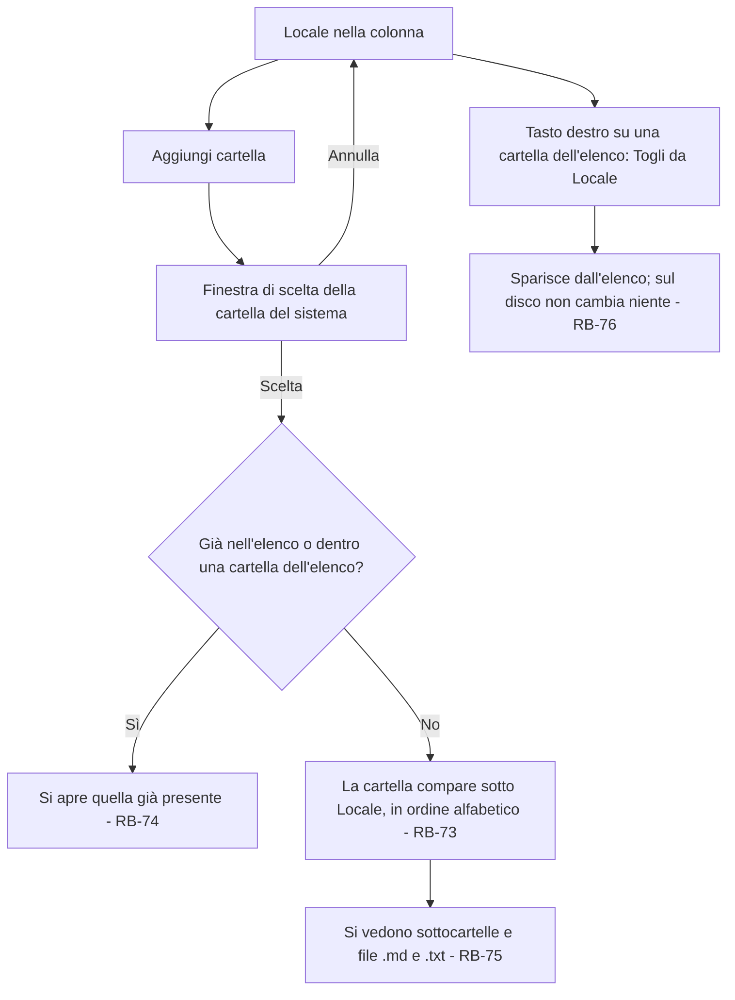
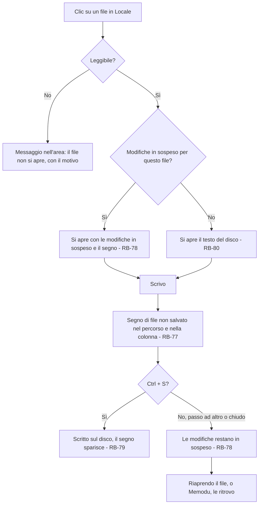
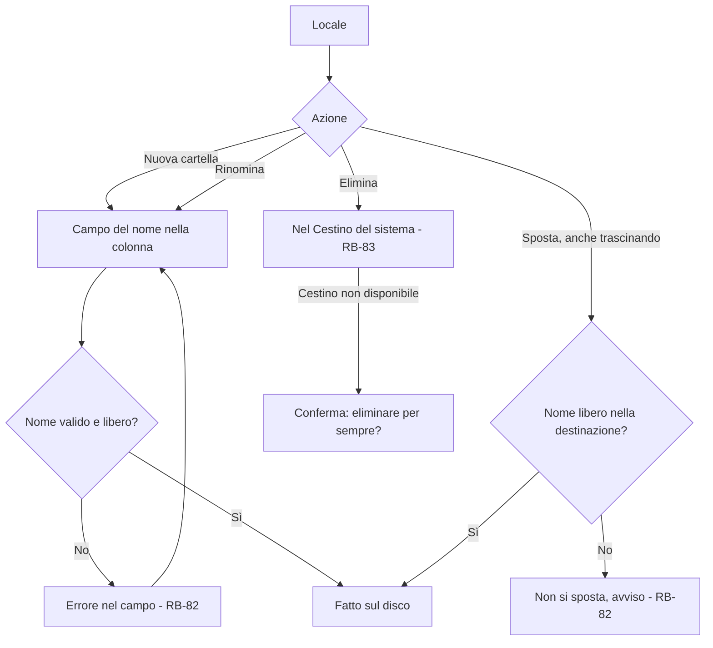
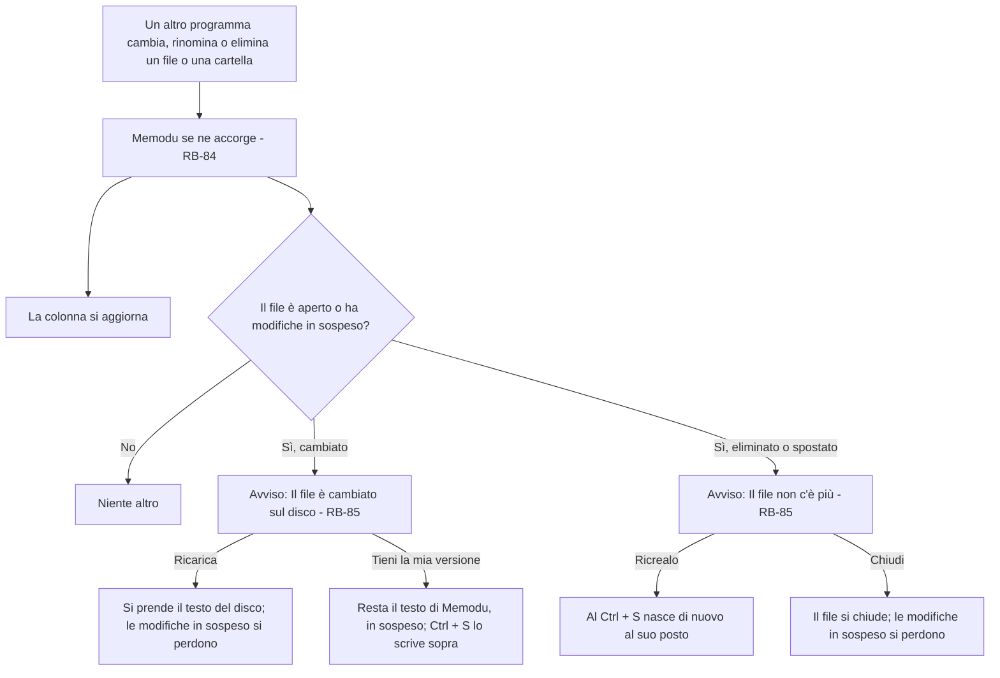
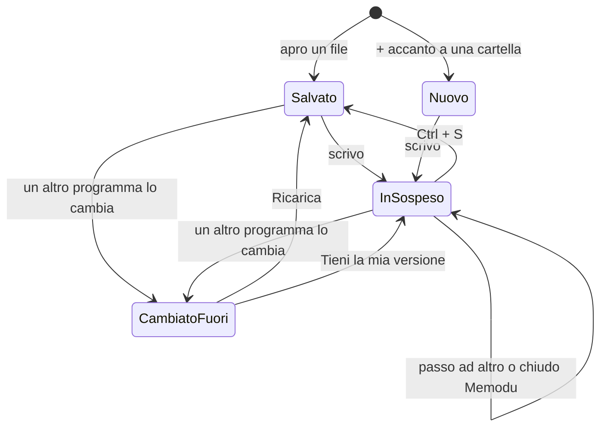

# Locale – Flussi

<!-- Fase 2 della guida. I diagrammi si scrivono in Mermaid. -->

Scelte di Manuel Cucca del 04/10/2026: le modifiche non salvate restano in sospeso passando ad altro e si conservano anche chiudendo Memodu; un file nuovo prende il nome dalla prima riga al primo Ctrl + S, come una nota; si vedono tutte le sottocartelle tranne quelle nascoste; un file non UTF-8 si legge come Windows-1252 e si salva in UTF-8; un cambio fatto fuori mostra sempre l'avviso. Le parti segnate sono dell'agente, da confermare.

## FL-10 – Aggiungere e togliere una cartella
**Requisito:** RF-17 · **Attori:** Utente

### Percorsi alternativi
- Locale senza cartelle: stato vuoto con «Aggiungi cartella».
- Una cartella dell'elenco che sul disco non c'è più (spostata, rinominata, chiavetta tolta) resta nell'elenco come «non trovata», con Togli da Locale; ricompare piena quando torna.

### Sfighe gestite
| Sfiga | Rilevamento | Comunicazione | Via d'uscita |
|---|---|---|---|
| SF-16 Vuoto | Nessuna cartella nell'elenco, o una cartella senza file .md e .txt | Stato vuoto | Aggiungi cartella; nella cartella vuota il + per un file nuovo |
| SF-17 Troppo | Cartella con migliaia di file o sottocartelle | Nessuna: si leggono solo le cartelle aperte nella colonna | — |
| SF-19 Duplicati | La cartella scelta è già nell'elenco o sta dentro una di esse | Si apre e si evidenzia quella che c'è | — |
| SF-20 Riferimenti spariti | La cartella non esiste più sul disco | Riga «non trovata» | Togli da Locale, o rimetterla al suo posto |
| SF-37 Il disco rifiuta | La cartella non si può leggere | Riga «non accessibile» | Togli da Locale |

### Sfighe considerate e scartate
- SF-22 Modifica simultanea dell'elenco: l'elenco vale solo per questo computer (RF-17).

---

## FL-11 – Aprire, modificare e salvare un file
**Requisito:** RF-17 · **Attori:** Utente

### Percorsi alternativi
- File nuovo: il + accanto a una cartella apre un file vuoto, non ancora sul disco, in sospeso; al primo Ctrl + S nasce sul disco con il nome dalla prima riga e l'estensione .md (RB-81).
- File non UTF-8: si legge come Windows-1252; al primo Ctrl + S si salva in UTF-8 e lo si dice una volta (RB-80).
- File in sola lettura sul disco: si apre ma non si modifica, con il motivo.

### Sfighe gestite
| Sfiga | Rilevamento | Comunicazione | Via d'uscita |
|---|---|---|---|
| SF-02 Abbandono a metà | Passo ad altro o chiudo Memodu senza salvare | Segno di non salvato nella colonna | Le modifiche restano in sospeso (RB-78) |
| SF-06 Input strani | A capo di Windows (CRLF), BOM, tabulazioni | Nessuna | Si conservano come erano |
| SF-17 Troppo | File oltre 10 MB | Messaggio nell'area: troppo grande da aprire | Aprirlo con un altro programma |
| SF-21 File problematici | Non UTF-8; byte non validi | Avviso «Salvato in UTF-8» al primo salvataggio | Si salva in UTF-8 (RB-80) |
| SF-37 Il disco rifiuta | Il disco rifiuta la scrittura al Ctrl + S | Avviso «Non si può salvare», con il motivo | Le modifiche restano in sospeso; si riprova |
| SF-20 Riferimenti spariti | Il file non c'è più quando salvo | Avviso Ricrealo / Scarta | Ricrearlo con il testo in sospeso o scartare |

---

## FL-12 – Gestire file e cartelle sul disco
**Requisito:** RF-17 · **Attori:** Utente

### Percorsi alternativi
- Rinominare un file: dal campo nel percorso, come il titolo di una nota; l'estensione si vede e si può cambiare tra .md e .txt.
- Un file con modifiche in sospeso si può rinominare e spostare; le modifiche lo seguono.
- Spostare tra due cartelle dell'elenco, anche su dischi diversi, si può.

### Sfighe gestite
| Sfiga | Rilevamento | Comunicazione | Via d'uscita |
|---|---|---|---|
| SF-01 Doppio clic | Due Elimina o due Crea di fila | Nessuna | La seconda richiesta trova già fatto e non fa niente |
| SF-06 Input strani | Caratteri non ammessi nel nome (`\ / : * ? " < > |`), nomi riservati di Windows | Errore nel campo | Correggere il nome |
| SF-19 Duplicati | Nome già usato nella stessa cartella (anche solo per maiuscole su Windows e Mac) | Errore nel campo o avviso | Un altro nome |
| SF-20 Riferimenti spariti | L'elemento non c'è più sul disco | La colonna si aggiorna | — |
| SF-37 Il disco rifiuta | Il disco rifiuta l'operazione | Avviso con il motivo | Nessuna modifica |

---

## FL-13 – Un file cambia fuori da Memodu
**Requisito:** RF-17 · **Attori:** Utente, Sistema (altri programmi)

### Sfighe gestite
| Sfiga | Rilevamento | Comunicazione | Via d'uscita |
|---|---|---|---|
| SF-22 Modifica simultanea | Il file sul disco è diverso da quello letto | Avviso Ricarica / Tieni la mia versione | Scelta dell'utente (RB-85) |
| SF-10 App in background | Memodu chiuso mentre il file cambia | Alla riapertura del file, lo stesso avviso se ha modifiche in sospeso | Come sopra |

---

## Diagrammi a stati

### File locale aperto – Stati

| Transizione | Chi può attivarla | Regola |
|---|---|---|
| Scrivo | Utente | RB-77 |
| Ctrl + S | Utente | RB-79, RB-81 |
| Passo ad altro o chiudo Memodu | Utente | RB-78 |
| Cambiato fuori | Sistema | RB-84, RB-85 |
| Ricarica, Tieni la mia versione | Utente | RB-85 |

---

## Regole di business
| Codice | Regola | Usata in |
|---|---|---|
| RB-73 | Le cartelle aggiunte compaiono sotto Locale in ordine alfabetico; l'elenco vale solo per questo computer e non va sul server | FL-10 |
| RB-74 | Una cartella già nell'elenco, o che sta dentro una cartella dell'elenco, non si aggiunge due volte | FL-10 |
| RB-75 | Si vedono tutte le sottocartelle tranne quelle nascoste (il nome comincia con il punto) e solo i file .md e .txt; prima i file, poi le cartelle, in ordine alfabetico (DEC-119) | FL-10 |
| RB-76 | Togliere una cartella da Locale non cambia niente sul disco | FL-10 |
| RB-77 | Un file con modifiche non salvate ha un segno nel percorso e nella colonna; si salva solo con Ctrl + S (⌘ + S su Mac) | FL-11 |
| RB-78 | Le modifiche non salvate restano in sospeso passando ad altro e chiudendo Memodu: Memodu le conserva su questo computer, non nel file, e le ritrova riaprendo il file | FL-11 |
| RB-79 | Ctrl + S scrive il file sul disco così com'è nell'editor; gli a capo e il BOM restano come erano | FL-11 |
| RB-80 | Un file non UTF-8 si legge come Windows-1252 e al primo salvataggio diventa UTF-8, avvisando una volta | FL-11 |
| RB-81 | Un file nuovo prende il nome dalla prima riga al primo Ctrl + S, con l'estensione .md; se il nome c'è già si aggiunge un numero | FL-11 |
| RB-82 | Nomi di file e cartelle: niente caratteri non ammessi dal sistema, niente doppioni nella stessa cartella | FL-12 |
| RB-83 | Eliminare manda file e cartelle nel Cestino del sistema; se non si può (disco di rete, chiavetta), si chiede se eliminarli per sempre | FL-12 |
| RB-84 | Memodu si accorge dei cambi fatti sul disco da altri programmi nelle cartelle dell'elenco e aggiorna la colonna | FL-13 |
| RB-85 | Se un file aperto o con modifiche in sospeso cambia o sparisce sul disco, compare sempre l'avviso con la scelta: Ricarica o Tieni la mia versione; Ricrealo o Chiudi | FL-13 |
