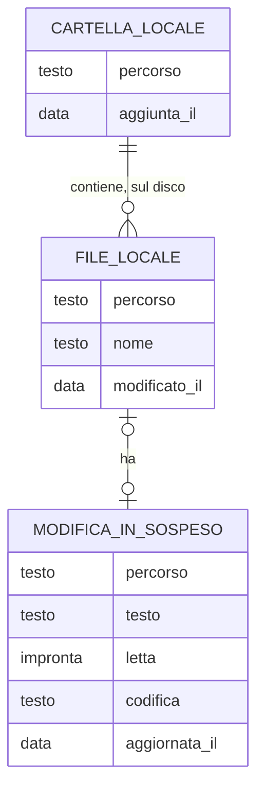

# Locale – Entità

<!-- Fase 3 della guida. -->

I file e le cartelle stanno sul disco: Memodu non ne tiene una copia. Conserva solo, su questo computer, l'elenco delle cartelle aggiunte e le modifiche in sospeso (RB-73, RB-78). Niente va sul server (DEC-115).

## Diagramma ER

## EN-09 – Cartella locale
**Descrizione:** una cartella del disco aggiunta sotto Locale (RF-17, FL-10).

| Attributo | Tipo | Obbligatorio | Vincoli | Note |
|---|---|---|---|---|
| Percorso | Testo | Sì | Assoluto; unico nell'elenco; non dentro un'altra cartella dell'elenco (RB-74) | Il nome mostrato è l'ultima parte del percorso |
| Aggiunta il | Data e ora | Sì | | Tecnico |
| Stato | presente \| non trovata \| non accessibile | Sì | Si ricava dal disco a ogni lettura, non si conserva | FL-10 |

- **Chi la crea:** l'utente, con Aggiungi cartella.
- **Chi la modifica:** nessuno: se la cartella cambia nome sul disco diventa «non trovata» e si aggiunge di nuovo.
- **Cancellazione:** definitiva dall'elenco con Togli da Locale; sul disco non cambia niente (RB-76).
- **Dati sensibili:** il percorso dice come sono organizzati i file del computer; resta solo sul computer, nel file della copia di lavoro, e non va sul server.

## EN-10 – File locale
**Descrizione:** un file .md o .txt del disco dentro una cartella dell'elenco (RB-75). Memodu lo legge e lo scrive, non lo conserva.

| Attributo | Tipo | Obbligatorio | Vincoli | Note |
|---|---|---|---|---|
| Percorso | Testo | Sì | Dentro una cartella dell'elenco | Identifica il file: rinominare o spostare cambia il percorso |
| Nome | Testo | Sì | Estensione .md o .txt; caratteri ammessi dal sistema; unico nella cartella (RB-82) | |
| Contenuto | Testo | Sì | Al massimo 10 MB per aprirlo | Letto in UTF-8 o Windows-1252, scritto in UTF-8 (RB-80); a capo e BOM come erano (RB-79) |
| Modificato il | Data e ora | Sì | | Dal disco; serve a capire se è cambiato fuori (RB-84) |
| Sola lettura | Sì \| No | Sì | | Dal disco |

- **Chi lo crea:** l'utente (il file nasce sul disco al primo Ctrl + S, RB-81) o un altro programma.
- **Chi lo modifica:** l'utente con Ctrl + S, o un altro programma (FL-13).
- **Cancellazione:** nel Cestino del sistema; per sempre, dopo una conferma, solo se il Cestino non c'è (RB-83).
- **Dati sensibili:** il contenuto resta sul disco; Memodu non lo copia altrove, salvo le modifiche in sospeso (EN-11).

## EN-11 – Modifica in sospeso
**Descrizione:** il testo di un file locale modificato in Memodu e non ancora salvato, o di un file nuovo non ancora creato (RB-78).

| Attributo | Tipo | Obbligatorio | Vincoli | Note |
|---|---|---|---|---|
| Percorso | Testo | Sì | Unico: una sola modifica in sospeso per file | Per un file nuovo: la cartella e un segnaposto, finché non ha nome |
| Testo | Testo | Sì | Al massimo 10 MB | Il testo nell'editor |
| Impronta letta | Testo | No | | Impronta del file sul disco quando lo si è letto: se il disco cambia, compare l'avviso (RB-85). Vuota per un file nuovo |
| Codifica | utf-8 \| windows-1252 | Sì | | Quella letta; al salvataggio si scrive UTF-8 (RB-80) |
| Aggiornata il | Data e ora | Sì | | |

- **Chi la crea:** il sistema, alla prima modifica di un file salvato o alla creazione di un file nuovo.
- **Chi la modifica:** il sistema mentre si scrive; segue il file se lo si rinomina o sposta in Memodu.
- **Cancellazione:** definitiva, al Ctrl + S riuscito, con Ricarica o con Chiudi nell'avviso del file sparito (RB-85).
- **Dati sensibili:** una copia del testo del file resta nella copia di lavoro di questo computer finché non si salva; come la copia di lavoro, non è cifrata sul disco (rischio già accettato). Non va sul server.
