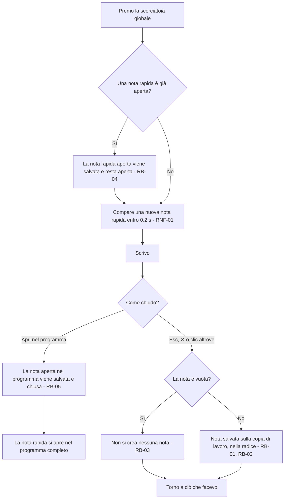
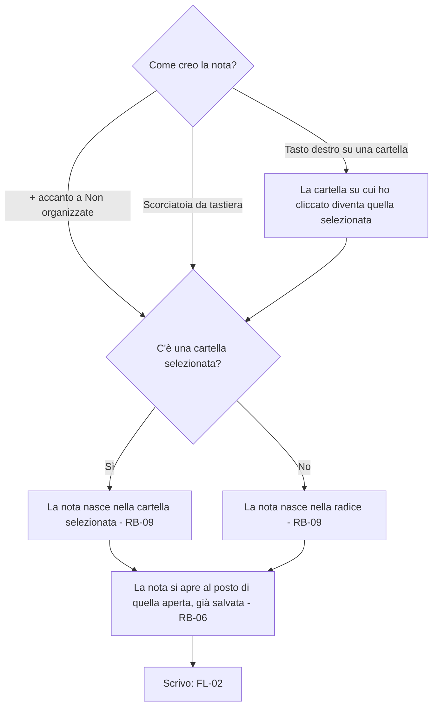
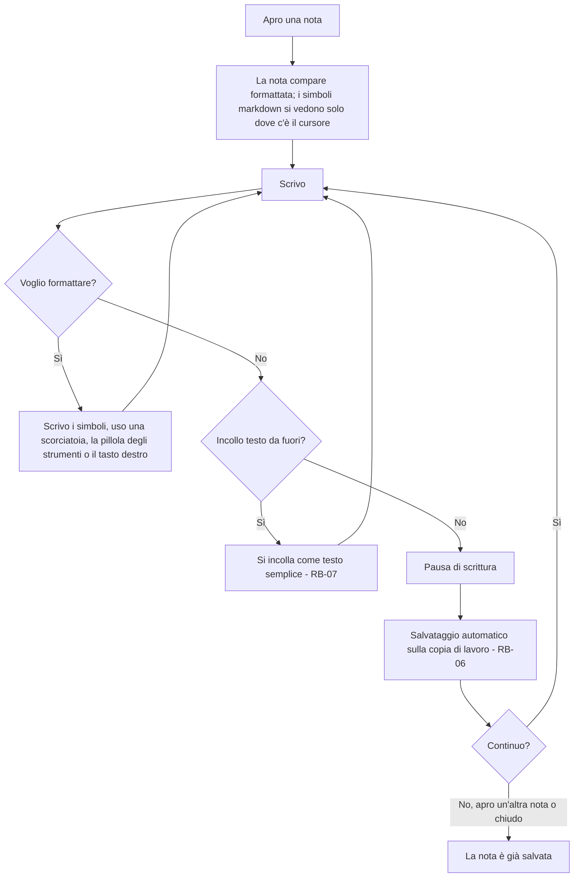
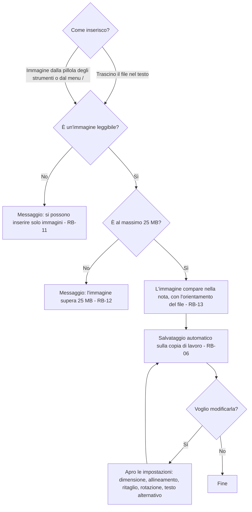
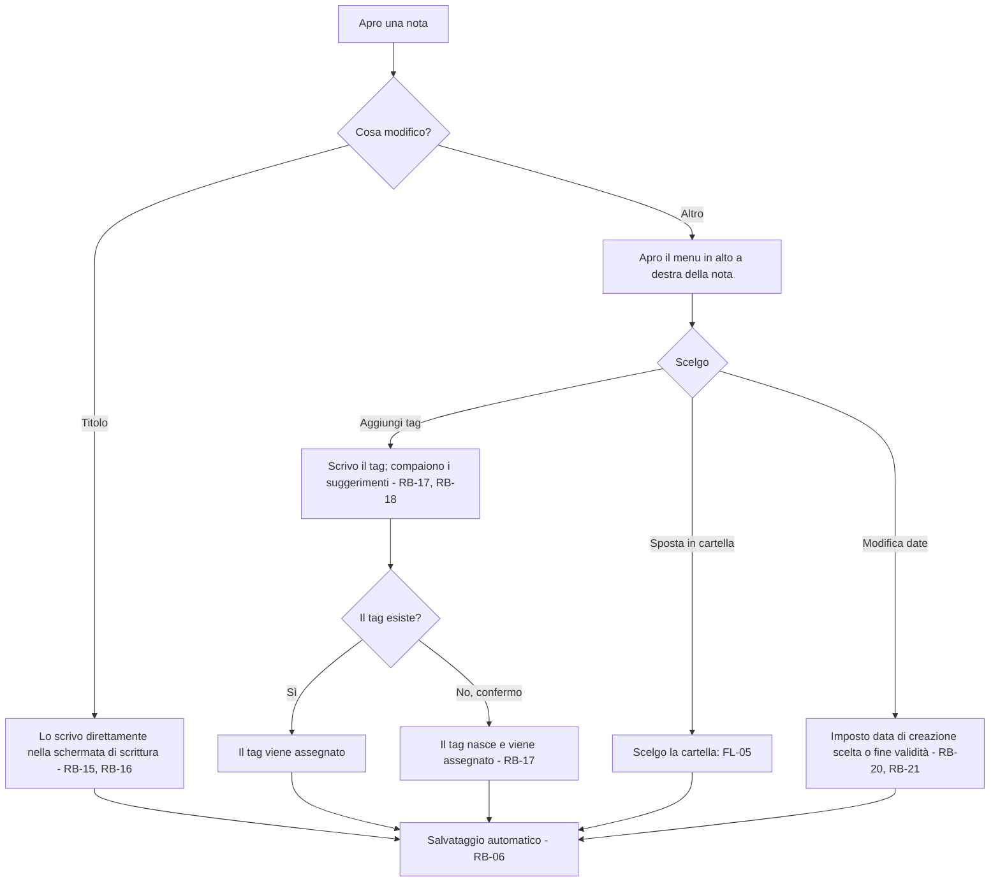

# Note – Flussi

<!-- Fase 2 della guida. I diagrammi si scrivono in Mermaid. -->

## FL-01 – Nota rapida
**Requisito:** RF-01 · **Attori:** Utente (solo app desktop, DEC-13) · **Interazioni rapide:** scorciatoia globale (RF-11)

### Percorsi alternativi
- **Chiusura** (Esc, ✕, clic fuori dalla finestra): salva e chiude; non esiste un pulsante Salva e chiudi (RB-02, SC-02).
- **Scorciatoia premuta con una nota rapida già aperta:** la nota aperta viene salvata e resta aperta, e se ne apre una nuova in un'altra finestra (RB-04). Ogni nota rapida si chiude poi per conto suo, seguendo lo stesso flusso.
- **Apertura nel programma completo:** vedi RB-05.

### Sfighe gestite
| Sfiga | Rilevamento | Comunicazione | Via d'uscita |
|---|---|---|---|
| SF-01 Doppio invio | Scorciatoia premuta con una nota rapida già aperta | Compare una nuova nota rapida in un'altra finestra | La precedente è salvata e resta aperta (RB-04) |
| SF-04 Più schede aperte | Più finestre di nota rapida aperte insieme | Ogni finestra è indipendente e compare a cascata rispetto alla precedente (SC-02) | Ognuna si salva e si chiude per conto suo (RB-02) |
| SF-02 Abbandono a metà | Finestra chiusa senza scegliere | Nessun messaggio | Salvataggio automatico (RB-02) |
| SF-08 Connessione che cade a metà | Assenza di rete | Nessun messaggio: la nota rapida non dipende dalla rete | Salvataggio sulla copia di lavoro, sincronizzazione più tardi (DEC-02) |
| SF-16 Vuoto | Nota rapida chiusa senza testo | Nessun messaggio | Non si crea nessuna nota (RB-03) |

### Sfighe considerate e scartate
- SF-03 Tasto indietro e refresh: la nota rapida è una finestra desktop, senza navigazione.
- SF-05 Cambio idea: dopo il salvataggio la nota si modifica come tutte le altre (FL-02).
- SF-06 Input strani ma legittimi, SF-17 Troppo, SF-36 Input malevolo: riguardano l'editor, gestiti in FL-02.
- SF-10 App in background o schermo bloccato, SF-32 Errore a metà operazione: dipendono dal salvataggio durante la scrittura, gestito in FL-02.
- SF-11 Dispositivo limitato: la prima fase è solo desktop (DEC-13).
- SF-12 Sessione scaduta: non c'è sessione, il dispositivo usa le credenziali preimpostate (RF-14, DEC-13).
- SF-13, SF-14, SF-15 (tempo): nessuna scadenza o data coinvolta.
- SF-18 … SF-31, SF-33 … SF-35: nessun valore limite, dato condiviso, permesso, sistema esterno o accesso remoto coinvolto.

---

## FL-09 – Creare una nota nel programma completo
**Requisiti:** RF-02, RF-05 · **Attori:** Utente · **Interazioni rapide:** scorciatoia da tastiera, menu del tasto destro (RF-11)

### Percorsi alternativi
- **Nota lasciata vuota:** resta come nota vuota e si può cancellare a mano (RB-10). È diverso dalla nota rapida, che vuota non si crea (RB-03).

### Sfighe gestite
| Sfiga | Rilevamento | Comunicazione | Via d'uscita |
|---|---|---|---|
| SF-01 Doppio invio | Comando Nuova nota ripetuto | Si apre una nuova nota ogni volta | Le note vuote restano e si cancellano a mano (RB-10) |
| SF-16 Vuoto | Nuova nota lasciata senza testo | Nessun messaggio | La nota vuota resta (RB-10) |
| SF-20 Riferimenti spariti | Alla sincronizzazione, la cartella di destinazione risulta nel cestino perché eliminata da un altro dispositivo | Nessun messaggio | La cartella esce dal cestino e torna com'era, con la nota dentro (RB-30) |

### Sfighe considerate e scartate
- SF-02 Abbandono a metà, SF-10, SF-32: la nota è salvata di continuo (RB-06), vedi FL-02.
- SF-08 Connessione che cade a metà: la nota nasce sulla copia di lavoro (DEC-02).
- Le altre sfighe non riguardano la creazione: nessuna data, valore limite, file, permesso o sistema esterno coinvolto.

---

## FL-02 – Scrivere e formattare una nota
**Requisito:** RF-02 · **Attori:** Utente · **Interazioni rapide:** scorciatoie da tastiera, menu del tasto destro (RF-11)

### Percorsi alternativi
- **Formattazione:** si applica in quattro modi equivalenti: scrivendo i simboli markdown, con le scorciatoie da tastiera, con la pillola degli strumenti che compare sopra il testo selezionato (SC-03) o con il menu del tasto destro.
- **Cambio di nota:** il programma mostra una nota alla volta (RF-01): aprendone un'altra, quella corrente è già salvata (RB-06).

### Sfighe gestite
| Sfiga | Rilevamento | Comunicazione | Via d'uscita |
|---|---|---|---|
| SF-02 Abbandono a metà | Programma chiuso durante la scrittura | Nessun messaggio | Le modifiche sono già salvate (RB-06) |
| SF-06 Input strani ma legittimi | Testo incollato da Word, web o email | Nessun messaggio | Si incolla come testo semplice (RB-07) |
| SF-08 Connessione che cade a metà | Assenza di rete | Nessun messaggio: la scrittura non dipende dalla rete | Salvataggio sulla copia di lavoro, sincronizzazione più tardi (DEC-02) |
| SF-10 App in background o schermo bloccato | Sospensione del dispositivo durante la scrittura | Nessun messaggio | Si perde al massimo l'ultima pausa di scrittura (RB-06) |
| SF-32 Errore a metà operazione | Crash del programma durante la scrittura | Alla riapertura la nota mostra l'ultimo salvataggio | Si perde al massimo l'ultima pausa di scrittura (RB-06) |
| SF-36 Input malevolo | Script o HTML attivo nel testo, incollato o scritto | Il codice si vede come testo oppure viene rimosso | Il contenuto delle note non esegue mai codice (RB-08) |

### Sfighe considerate e scartate
- SF-01 Doppio invio, SF-03 Tasto indietro e refresh: non esiste un'azione di invio, il salvataggio è continuo (RB-06).
- SF-04 Più schede aperte: il programma mostra una nota alla volta (RF-01). La stessa nota aperta su due dispositivi è un conflitto, gestito in FL-07.
- SF-05 Cambio idea: la nota resta sempre modificabile.
- SF-12 Sessione scaduta: non c'è sessione, il dispositivo usa le credenziali preimpostate (RF-14, DEC-13).
- SF-16 Vuoto: la nuova nota vuota resta (RB-10), vedi FL-09.
- SF-17 Troppo: nessun limite di lunghezza documentato; nessuna soglia sulla digitazione (RNF-01).
- SF-22 Modifica simultanea: gestita in FL-07.
- SF-13 … SF-15, SF-18 … SF-21, SF-23 … SF-31, SF-33 … SF-35: nessuna data, valore limite, file, permesso o sistema esterno coinvolto. I file sono in FL-03.

---

## FL-03 – Inserire un'immagine
**Requisito:** RF-03 · **Attori:** Utente · **Interazioni rapide:** trascinamento (RF-11)

### Percorsi alternativi
- **Più immagini insieme:** ognuna segue il flusso; quelle non valide vengono rifiutate con il loro messaggio, le altre si inseriscono.
- **Testo alternativo:** di default è il nome del file e si cambia dalle impostazioni dell'immagine.
- **Immagine tolta dal testo:** si recupera con Annulla finché la nota è aperta (RB-46).
- **Immagine copiata in un'altra nota:** diventa indipendente (RB-47).

### Sfighe gestite
| Sfiga | Rilevamento | Comunicazione | Via d'uscita |
|---|---|---|---|
| SF-08 Connessione che cade a metà | Assenza di rete durante la sincronizzazione dell'immagine | Nessun messaggio durante l'inserimento | L'immagine è sulla copia di lavoro e si sincronizza più tardi (DEC-02) |
| SF-17 Troppo | Immagine oltre 25 MB | Messaggio: supera il limite (testo definitivo in Fase 6) | Non viene inserita; si può ridurla e riprovare (RB-12) |
| SF-21 File problematici: formato | Il file non è un'immagine | Messaggio: si possono inserire solo immagini | Non viene inserito (RB-11) |
| SF-21 File problematici: corrotto | L'immagine non si riesce a leggere | Stesso messaggio del formato | Non viene inserita (RB-11) |
| SF-21 File problematici: foto ruotata | Nessun rilevamento: si mostra com'è (RB-13) | — | Rotazione dalle impostazioni dell'immagine |
| SF-36 Input malevolo | Immagine che contiene codice (es. SVG con script) | Nessun messaggio | Il codice non viene mai eseguito (RB-08) |

### Sfighe considerate e scartate
- SF-01 Doppio invio: trascinare due volte la stessa immagine la inserisce due volte, come in qualsiasi editor; si cancella a mano.
- SF-02, SF-10, SF-32: l'inserimento è salvato come ogni altra modifica (RB-06).
- SF-06 Nome con caratteri speciali: il nome diventa solo il testo alternativo di default, modificabile.
- SF-20 Riferimenti spariti: l'immagine è parte della nota; cancellarla dalla nota la rimuove.
- Le altre sfighe non riguardano l'inserimento: nessuna data, permesso o sistema esterno coinvolto.

---

## FL-04 – Modificare i metadati
**Requisiti:** RF-04, RF-06 · **Attori:** Utente · **Interazioni rapide:** menu della nota (RF-11)

### Percorsi alternativi
- **Togliere un tag da una nota:** dal menu della nota; la nota resta intatta.
- **Eliminare un tag del tutto:** tasto destro sul tag tra i suggerimenti, poi Elimina tag… e conferma con il numero di note coinvolte (RB-19).
- **Data di creazione scelta:** si salva accanto a quella di sistema, che non cambia mai (RB-21). Nelle liste si mostra la data scelta, se c'è (RF-04).

### Sfighe gestite
| Sfiga | Rilevamento | Comunicazione | Via d'uscita |
|---|---|---|---|
| SF-15 Date particolari | Fine validità già passata | Nessun messaggio | Si salva: la data è solo informativa (RB-20) |
| SF-16 Vuoto | Nota senza titolo | Nelle liste compaiono le prime parole del testo | Il titolo si può scrivere in qualsiasi momento (RB-15) |
| SF-18 Valori limite | Creazione nel futuro, fine validità precedente alla creazione | Nessun messaggio | Si salva comunque (RB-20) |
| SF-19 Duplicati: titoli | Due note con lo stesso titolo | Nessun messaggio | Ammesso (RB-16) |
| SF-19 Duplicati: tag | Si scrive un tag che esiste già | Il tag esistente compare tra i suggerimenti | Si assegna quello esistente (RB-17) |
| SF-20 Riferimenti spariti | Il tag viene eliminato mentre è assegnato | Conferma con il numero di note coinvolte | Le note restano intatte (RB-19) |

### Sfighe considerate e scartate
- SF-01 Doppio invio, SF-02 Abbandono, SF-10, SF-32: ogni modifica è salvata subito (RB-06).
- SF-06 Input strani nei tag: gestiti da RB-22.
- SF-14 Fusi orari e ora legale: come si memorizzano le date si decide in Fase 7.
- SF-22 Modifica simultanea da due dispositivi: gestita in FL-07.
- Le altre sfighe non riguardano i metadati: nessun file, permesso o sistema esterno coinvolto.

---

## Diagrammi a stati

La posizione di una nota (radice, cartella, cestino) è descritta nel diagramma a stati di FL-05, nel modulo organizzazione. Nel modulo note nessun altro oggetto cambia stato nel tempo.

---

## Regole di business
| Codice | Regola | Usata in |
|---|---|---|
| RB-01 | Una nota rapida salvata va nella radice e diventa una nota non organizzata (RF-05) | FL-01 |
| RB-02 | Chiudere la nota rapida (Esc, ✕, clic altrove) la salva: non serve un comando di salvataggio | FL-01 |
| RB-03 | Una nota rapida chiusa senza testo non crea nessuna nota | FL-01 |
| RB-04 | Premere la scorciatoia con una nota rapida già aperta salva quella aperta, che resta aperta, e ne apre una nuova in un'altra finestra | FL-01 |
| RB-05 | Aprendo la nota rapida nel programma completo, la nota aperta nel programma viene salvata e chiusa, e al suo posto compare la nota rapida | FL-01 |
| RB-06 | Ogni modifica a una nota si salva da sola sulla copia di lavoro dopo una breve pausa di scrittura (valore indicativo 1 s, da fissare in Fase 7). Non esiste un pulsante Salva | FL-01, FL-02 |
| RB-07 | Il testo incollato da fuori (Word, web, email) si incolla sempre come testo semplice | FL-02 |
| RB-08 | Il contenuto delle note non esegue mai codice: script e HTML attivo si mostrano come testo o vengono rimossi, su desktop e web | FL-02 |
| RB-09 | Una nuova nota creata nel programma completo nasce nella cartella selezionata; se nessuna cartella è selezionata, nasce nella radice | FL-09 |
| RB-10 | Una nuova nota creata nel programma completo e lasciata vuota resta; si può eliminare a mano, e finisce nel cestino (RB-26) | FL-09 |
| RB-11 | Nella prima fase si possono inserire solo immagini leggibili; gli altri file e le immagini corrotte vengono rifiutati con un messaggio | FL-03 |
| RB-12 | Un'immagine può pesare al massimo 25 MB | FL-03 |
| RB-13 | Un'immagine si mostra con l'orientamento salvato nel file; si raddrizza con la rotazione delle impostazioni | FL-03 |
| RB-14 | Ritaglio e rotazione di un'immagine sono reversibili: l'originale resta intatto e le impostazioni si possono togliere o cambiare in qualsiasi momento | FL-03 |
| RB-15 | Se una nota non ha titolo, nelle liste si mostrano le prime parole del testo; il titolo resta vuoto finché l'utente non lo scrive. Una nota senza titolo e senza testo si mostra come "Nota vuota", in grigio chiaro | FL-04 |
| RB-16 | Più note possono avere lo stesso titolo, anche nella stessa cartella: il titolo non identifica la nota | FL-04 |
| RB-17 | Un tag nasce scrivendolo: mentre si scrive compaiono i tag esistenti come suggerimento, e un tag nuovo confermato viene creato | FL-04 |
| RB-18 | I livelli di un tag si separano con `/` (es. `lavoro/clienti/rossi`) | FL-04 |
| RB-19 | Eliminare un tag lo toglie da tutte le note che lo usano, senza modificarle altrimenti; prima si chiede conferma indicando quante note lo usano. Anche i suoi sotto-tag vengono eliminati allo stesso modo | FL-04 |
| RB-20 | Le date scelte dall'utente (creazione e fine validità) ammettono qualsiasi combinazione, senza avvisi | FL-04 |
| RB-21 | La data di creazione di sistema non si può cambiare: una data di creazione scelta dall'utente si salva a parte e non la sovrascrive | FL-04 |
| RB-22 | Nei tag maiuscole e minuscole non contano (`Lavoro` e `lavoro` sono lo stesso tag, mostrato come è stato scritto la prima volta). Spazi, accenti ed emoji sono ammessi. I `/` all'inizio, alla fine o doppi si correggono in automatico | FL-04 |
| RB-46 | Un'immagine tolta dal testo si recupera con Annulla (Ctrl+Z / Cmd+Z) finché la nota è aperta; chiusa la nota, l'immagine è cancellata definitivamente | FL-03 |
| RB-47 | Copiando un'immagine da una nota a un'altra nasce un'immagine indipendente, con le sue impostazioni: un'immagine appartiene sempre a una sola nota | FL-03 |
| RB-58 | Le immagini seguono la loro nota: eliminandola vanno nel cestino con lei, ripristinandola tornano, eliminandola definitivamente si cancellano | FL-03, FL-05 |
| RB-59 | Annulla (Ctrl+Z / Cmd+Z) vale per tutte le modifiche della nota aperta: testo, formattazione, immagini e caselle. Non annulla le azioni fuori dalla nota (spostamenti, eliminazioni: per quelle c'è il cestino) | FL-02, FL-03 |
