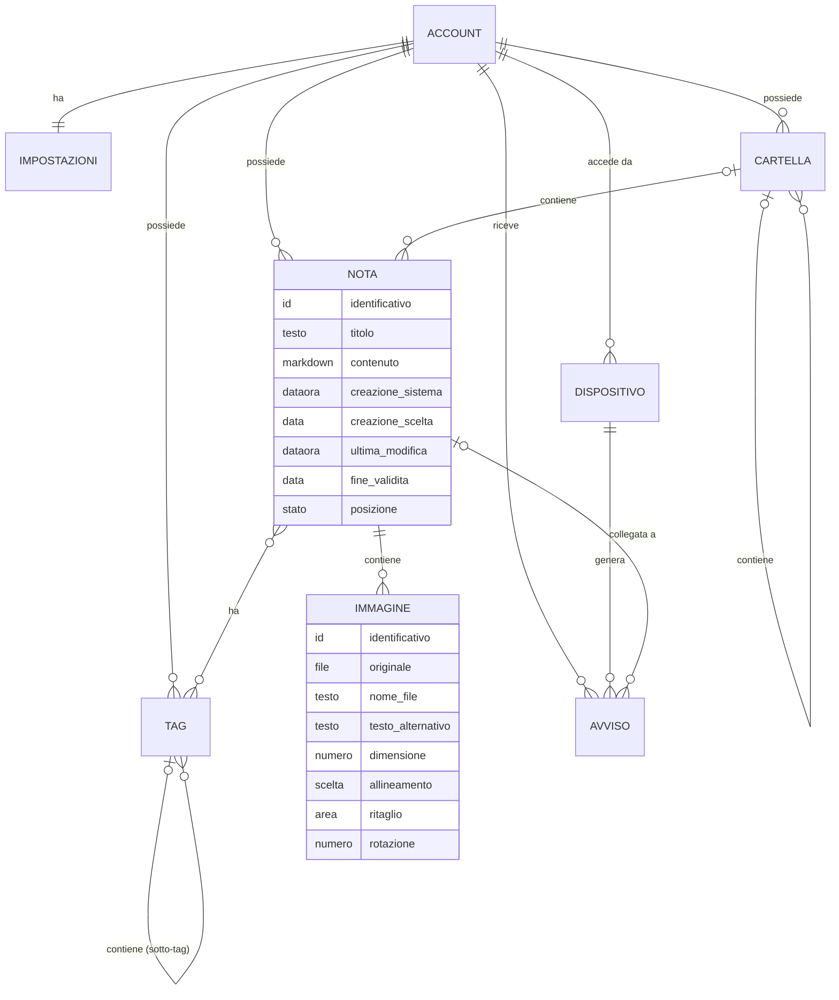

# Note – Entità

<!-- Fase 3 della guida. -->

## Diagramma ER
Diagramma di tutto il sistema: le entità degli altri moduli sono descritte nei rispettivi `3-entita.md`.

## EN-01 – Nota
**Descrizione:** un testo in markdown, con eventuali immagini, e i suoi metadati (RF-02, RF-03, RF-04).

| Attributo | Tipo | Obbligatorio | Vincoli | Note |
|---|---|---|---|---|
| Identificativo | Codice | Sì | Unico e stabile: non cambia se la nota viene rinominata o spostata | Tecnico, non visibile |
| Titolo | Testo | No | Può ripetersi (RB-16) | Se manca, nelle liste si mostrano le prime parole del testo (RB-15) |
| Contenuto | Markdown | No | Nessun limite di lunghezza | Può essere vuoto (RB-10) |
| Data di creazione di sistema | Data e ora | Sì | Non modificabile (RB-21) | Sempre visibile nei dettagli |
| Data di creazione scelta | Data | No | Qualsiasi valore (RB-20) | Se c'è, è la data di creazione mostrata (RF-04) |
| Data di ultima modifica | Data e ora | Sì | Impostata dal sistema | |
| Data di fine validità | Data | No | Qualsiasi valore (RB-20) | Solo informativa |
| Posizione | radice \| cartella \| cestino | Sì | | Stato del diagramma di FL-05 |
| Cartella | EN-03 | No | Una sola (RF-05) | Vuota se la nota è nella radice |
| Tag | EN-04, più di uno | No | | |
| Immagini | EN-02, più di una | No | | |

- **Chi la crea:** l'utente (FL-01, FL-09); il sistema, quando nasce una nota in conflitto (DEC-06).
- **Chi la modifica:** l'utente; il sistema, applicando le modifiche arrivate dagli altri dispositivi (FL-07).
- **Cancellazione:** archiviazione nel cestino (RB-26). Diventa definitiva solo quando l'utente svuota il cestino (RB-27, RB-32).
- **Dati sensibili:** tutti gli attributi sono cifrati end-to-end (DEC-08). Si conservano finché l'utente non li elimina definitivamente.

## EN-02 – Immagine
**Descrizione:** un'immagine inserita in una nota, con le sue impostazioni (RF-03).

| Attributo | Tipo | Obbligatorio | Vincoli | Note |
|---|---|---|---|---|
| Identificativo | Codice | Sì | Unico e stabile | Tecnico, non visibile |
| Nota | EN-01 | Sì | | |
| File originale | Immagine | Sì | Solo immagini leggibili (RB-11), massimo 25 MB (RB-12) | Resta sempre intatto (RB-14) |
| Nome del file | Testo | Sì | | |
| Testo alternativo | Testo | Sì | Di default è il nome del file (RF-03) | Modificabile |
| Dimensione | Numero | No | | Assente: dimensione originale |
| Allineamento | sinistra \| centro \| destra | No | Sempre su una riga a sé (RF-03) | |
| Ritaglio | Area | No | Reversibile (RB-14) | |
| Rotazione | 0° \| 90° \| 180° \| 270° | No | Reversibile (RB-14) | Di default si usa l'orientamento del file (RB-13) |

- **Chi la crea:** l'utente (FL-03).
- **Chi la modifica:** l'utente, dalle impostazioni dell'immagine.
- **Cancellazione:** togliendola dal testo si recupera con Annulla finché la nota è aperta, poi è definitiva (RB-46). Eliminando la nota, le sue immagini la seguono nel cestino.
- **Copia:** copiata in un'altra nota diventa un'immagine indipendente (RB-47).
- **Dati sensibili:** tutti gli attributi, file compreso, sono cifrati end-to-end (DEC-08).
