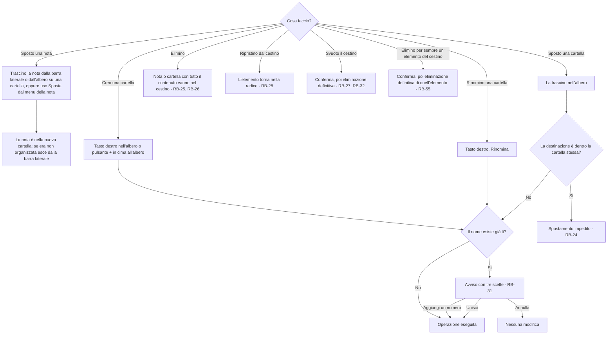
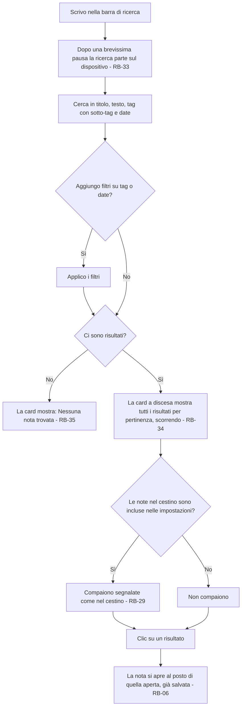
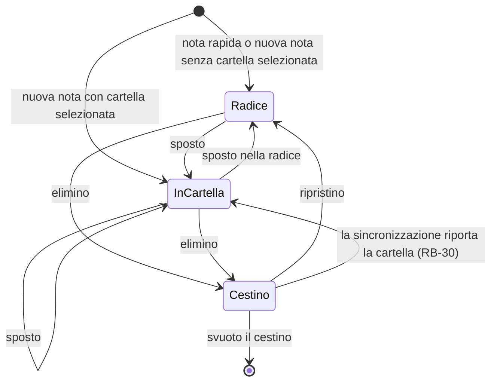

# Organizzazione – Flussi

<!-- Fase 2 della guida. I diagrammi si scrivono in Mermaid. -->

## FL-05 – Organizzare nelle cartelle
**Requisiti:** RF-05, RF-15 · **Attori:** Utente · **Interazioni rapide:** trascinamento, menu del tasto destro (RF-11)

### Percorsi alternativi
- **Nuova cartella dal tasto destro:** su una cartella crea una sottocartella; sullo spazio vuoto dell'albero crea una cartella al primo livello.
- **Nuova nota dal tasto destro su una cartella:** vedi FL-09.
- **Elemento ritrovato con la ricerca mentre è nel cestino:** è segnalato come "nel cestino" (RB-29).
- **Eliminare per sempre un solo elemento:** dal cestino, con Elimina definitivamente accanto a Ripristina; chiede conferma (RB-55, DEC-17). Una cartella si elimina con tutto il suo contenuto.

### Sfighe gestite
| Sfiga | Rilevamento | Comunicazione | Via d'uscita |
|---|---|---|---|
| SF-05 Cambio idea | Nota o cartella eliminata per errore | Nessun messaggio: l'elemento è nel cestino | Si ripristina dal cestino, nella radice (RB-28) |
| SF-18 Valori limite | Cartella trascinata dentro sé stessa o una sua sottocartella | Lo spostamento non avviene | Nessuna modifica (RB-24) |
| SF-19 Duplicati | Nome di cartella già presente nella destinazione | Avviso con le scelte: aggiungi un numero, unisci, annulla | L'utente sceglie (RB-31) |
| SF-20 Riferimenti spariti | Nota creata o spostata, su un altro dispositivo, in una cartella finita nel cestino | Nessun messaggio | La cartella torna dal cestino con la nota (RB-30) |
| SF-17 Troppo | Cestino con moltissimi elementi | Nessun messaggio | Resta finché l'utente non lo svuota (RB-27) |

### Sfighe considerate e scartate
- SF-01 Doppio invio, SF-02 Abbandono: ogni operazione è immediata e salvata (RB-06).
- SF-08 Connessione che cade a metà: le operazioni avvengono sulla copia di lavoro (DEC-02).
- SF-16 Vuoto: un albero senza cartelle mostra solo la radice; lo stato vuoto della schermata si disegna in Fase 4.
- SF-22 Modifica simultanea (per esempio la stessa cartella rinominata su due dispositivi): gestita in FL-07.
- Le altre sfighe non riguardano cartelle e cestino: nessuna data, file, permesso o sistema esterno coinvolto.

---

## FL-06 – Cercare e filtrare
**Requisiti:** RF-08, RF-15 · **Attori:** Utente

### Percorsi alternativi
- **Ricerca per tag:** cercando un tag si trovano anche le note con i suoi sotto-tag (RF-06). Maiuscole e minuscole non contano (RB-22).
- **Filtri:** tag e date dei metadati (creazione, ultima modifica, fine validità); il loro aspetto si disegna in Fase 4.
- **Risultato nel cestino:** aprendolo si vede che è nel cestino; si può ripristinare (RB-28).

### Sfighe gestite
| Sfiga | Rilevamento | Comunicazione | Via d'uscita |
|---|---|---|---|
| SF-06 Input strani | Maiuscole, accenti, spazi nella ricerca | Nessun messaggio | Maiuscole e minuscole non contano nei tag (RB-22) |
| SF-08 Connessione che cade a metà | Assenza di rete | Nessun messaggio: la ricerca avviene sul dispositivo | Cerca nella copia di lavoro (DEC-02) |
| SF-16 Vuoto | Nessun risultato | "Nessuna nota trovata" (testo definitivo in Fase 6) | Si cambia la ricerca o i filtri (RB-35) |
| SF-17 Troppo | Molti risultati | La card si scorre | Tutti i risultati, per pertinenza (RB-34) |
| SF-20 Riferimenti spariti | Il risultato viene eliminato, spostato o modificato mentre la card è aperta | I risultati restano quelli della ricerca | Cliccando si apre la versione aggiornata della nota (RB-45) |

### Sfighe considerate e scartate
- SF-01 Doppio invio: la ricerca parte da sola, non c'è invio (RB-33).
- SF-02 Abbandono: chiudere la card non modifica nulla.
- SF-36 Input malevolo: la ricerca non esegue il testo cercato (RB-08).
- Le altre sfighe non riguardano la ricerca: nessuna scrittura, file, permesso o sistema esterno coinvolto.
- Nota: con la cifratura end-to-end la ricerca richiede un indice sul dispositivo; le prestazioni sul web sono un'assunzione della visione.

---

## Diagrammi a stati

### Nota e cartella – Posizione

| Transizione | Chi può attivarla | Regola |
|---|---|---|
| Elimino | Utente | RB-25, RB-26 |
| Ripristino | Utente | RB-28 |
| Ritorno automatico dalla sincronizzazione | Sistema | RB-30 |
| Svuoto il cestino | Solo l'utente | RB-27 |

---

## Regole di business
| Codice | Regola | Usata in |
|---|---|---|
| RB-23 | Nella stessa cartella non possono esserci due cartelle con lo stesso nome | FL-05 |
| RB-24 | Le cartelle si annidano senza limiti di profondità; una cartella non si può spostare dentro sé stessa o dentro una sua sottocartella | FL-05 |
| RB-25 | Eliminare una cartella la manda nel cestino insieme a tutto il suo contenuto (note e sottocartelle) | FL-05 |
| RB-26 | Eliminare una nota la manda nel cestino | FL-05 |
| RB-27 | Gli elementi restano nel cestino finché l'utente non lo svuota o non li elimina uno per uno per sempre (RB-55); Memodu non cancella mai dati da solo | FL-05 |
| RB-28 | Un elemento ripristinato dal cestino torna sempre nella radice: la nota diventa non organizzata, la cartella torna al primo livello dell'albero | FL-05 |
| RB-29 | Le note nel cestino compaiono nella ricerca, segnalate come "nel cestino"; una preferenza nelle impostazioni permette di escluderle | FL-05, FL-06 |
| RB-30 | Se durante la sincronizzazione una nota risulta creata o spostata in una cartella che un altro dispositivo ha mandato nel cestino, la cartella esce dal cestino e torna com'era, con la nota dentro. È diverso dal ripristino manuale, che riporta tutto nella radice (RB-28) | FL-05, FL-07, FL-09 |
| RB-31 | Se creando, rinominando o spostando una cartella il nome esiste già nella destinazione, compare un avviso con tre scelte: aggiungere un numero (es. "Idee (2)"), unire le due cartelle o annullare. Unendo due cartelle, per ogni sottocartella con lo stesso nome ricompare lo stesso avviso | FL-05 |
| RB-32 | Svuotare il cestino chiede una conferma prima dell'eliminazione definitiva | FL-05 |
| RB-55 | Nel cestino un singolo elemento si può eliminare per sempre con "Elimina definitivamente"; prima si chiede conferma, indicando il nome e, per una cartella, quante note contiene (DEC-17) | FL-05 |
| RB-56 | Accanto a ogni cartella e alla sezione Non organizzate si mostra il numero di note che contiene, sottocartelle comprese; le note nel cestino non contano. Il numero si aggiorna subito (ID-15) | FL-05 |
| RB-33 | La ricerca parte mentre si scrive, dopo una brevissima pausa, senza premere Invio | FL-06 |
| RB-34 | I risultati si ordinano per pertinenza: prima le note con la parola nel titolo o nei tag, poi quelle con la parola solo nel testo. La card a discesa li mostra tutti e si scorre | FL-06 |
| RB-35 | Senza risultati la card resta aperta con il messaggio "Nessuna nota trovata" | FL-06 |
| RB-45 | Mentre la card è aperta i risultati non si aggiornano; cliccando un risultato si apre sempre la versione aggiornata della nota | FL-06 |
| RB-48 | Una nuova cartella nasce con il nome "Nuova cartella" (con un numero se il nome esiste già, RB-23), già selezionato per essere cambiato | FL-05 |
| RB-49 | Un tag continua a esistere anche quando nessuna nota lo usa più, e resta tra i suggerimenti finché l'utente non lo elimina (RB-19) | FL-04 |
