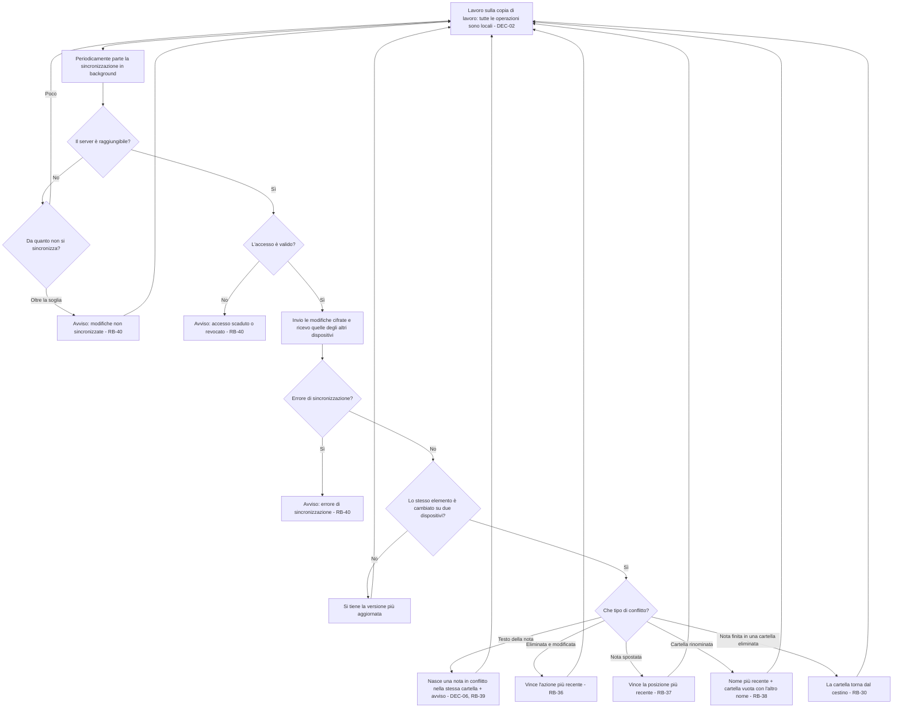
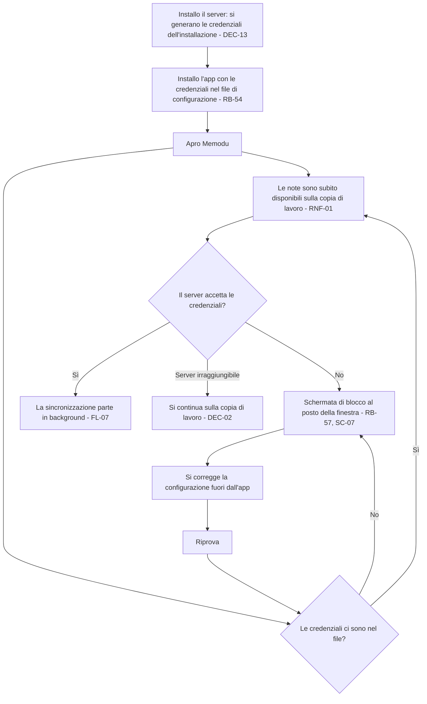

# Sincronizzazione – Flussi

<!-- Fase 2 della guida. I diagrammi si scrivono in Mermaid. -->

## FL-07 – Sincronizzare
**Requisito:** RF-10 · **Attori:** Utente, Sistema (sincronizzazione in background)

### Percorsi alternativi
- **Senza rete:** si continua a scrivere; le modifiche partono appena la rete torna (DEC-02).
- **Nessun problema:** la sincronizzazione è invisibile, non c'è nessun indicatore (RB-40).

### Sfighe gestite
| Sfiga | Rilevamento | Comunicazione | Via d'uscita |
|---|---|---|---|
| SF-08 Connessione che cade a metà | La sincronizzazione non si completa | Nessun messaggio, se dura poco | Riprova alla sincronizzazione successiva (DEC-02) |
| SF-20 Riferimenti spariti | Nota creata o spostata in una cartella eliminata altrove | Nessun messaggio | La cartella torna dal cestino (RB-30) |
| SF-22 Modifica simultanea | Lo stesso elemento cambiato su due dispositivi | Avviso solo per le note in conflitto (RB-39) | DEC-06, RB-36, RB-37, RB-38 |
| SF-25 Accesso revocato | Il server rifiuta le credenziali | Schermata di blocco (RB-57) | Si corregge la configurazione dell'app (FL-08) |
| SF-30 Servizio esterno fuori uso | Server irraggiungibile oltre la soglia | Avviso (RB-40) | Le modifiche restano sulla copia di lavoro finché il server non torna |
| SF-31 Notifiche perse | Un conflitto avviene mentre l'utente non guarda | L'avviso resta finché non viene visto | La nota in conflitto resta nella cartella, riconoscibile dal titolo (DEC-06) |
| SF-32 Errore a metà operazione | Errore durante l'invio o la ricezione | Avviso (RB-40) | Riprova alla sincronizzazione successiva; la copia di lavoro resta intatta |

### Sfighe considerate e scartate
- SF-01 … SF-07: la sincronizzazione non richiede azioni dell'utente.
- SF-12 Sessione scaduta: non c'è sessione, il dispositivo usa le credenziali preimpostate (RF-14); credenziali rifiutate sono SF-25.
- SF-14 Fusi orari: il confronto "più recente" tra dispositivi in fusi diversi si risolve in Fase 7.
- SF-33 Versioni diverse di app e server: si risolve in Fase 7.
- SF-34 … SF-36: il contenuto viaggia cifrato end-to-end (RNF-02); il collegamento è trattato in FL-08.

---

## FL-08 – Collegare un dispositivo
**Requisito:** RF-14 · **Attori:** Sistema

### Percorsi alternativi
- **Credenziali mancanti o rifiutate:** la finestra non si apre; al suo posto c'è la schermata di blocco con Riprova (RB-57, DEC-20). Se il rifiuto arriva con l'app aperta, anche la nota rapida passa alla schermata di blocco: quello che era scritto resta sulla copia di lavoro. La configurazione si corregge fuori dall'app.
- **Server irraggiungibile:** non blocca; si lavora sulla copia di lavoro (DEC-02, RB-40).
- **Credenziali perse:** il recupero è rimandato (domanda aperta su RF-10).
- **Cambio delle credenziali:** come si fa si decide in Fase 7.

### Sfighe gestite
| Sfiga | Rilevamento | Comunicazione | Via d'uscita |
|---|---|---|---|
| SF-07 Dimenticanze | Credenziali perse | Da definire | Rimandato: blocca la Definition of Ready di RF-14 |
| SF-25 Accesso revocato | Credenziali mancanti o rifiutate dal server | Schermata di blocco (SC-07, RB-57) | Si corregge la configurazione dell'app e si preme Riprova |

### Sfighe considerate e scartate
- SF-01 Doppio invio: collegarsi due volte non crea nulla di diverso.
- SF-12 Sessione scaduta: non c'è sessione (RF-14).
- SF-19 Duplicati, SF-27 Account non verificato: un solo utente, senza registrazione (DEC-13).
- SF-26 Accesso via link diretto: il web è rinviato (ID-19).
- SF-35 Tentativi ripetuti: non c'è una password da indovinare; le credenziali sono generate dal server.
- SF-36 Input malevolo: le credenziali non vengono eseguite né mostrate (RB-08).
- Le altre sfighe non riguardano il collegamento.

---

## Regole di business
| Codice | Regola | Usata in |
|---|---|---|
| RB-36 | Se una nota è stata eliminata su un dispositivo e modificata su un altro, vince l'azione più recente: se è la modifica, la nota esce dal cestino con le modifiche; se è l'eliminazione, la nota resta nel cestino con le modifiche comprese | FL-07 |
| RB-37 | Se una nota è stata spostata in cartelle diverse su due dispositivi, resta nella posizione più recente | FL-07 |
| RB-38 | Se una cartella è stata rinominata in modo diverso su due dispositivi, prende il nome più recente; accanto nasce una cartella vuota con l'altro nome, come segnale del conflitto | FL-07 |
| RB-39 | Quando nasce una nota in conflitto (DEC-06) compare un avviso con il collegamento alla nota. La nota in conflitto ha lo stesso titolo seguito da "(copia in conflitto)" | FL-07 |
| RB-40 | La sincronizzazione è invisibile finché va tutto bene. Compare un avviso solo per: errore di sincronizzazione (subito), server irraggiungibile oltre una soglia (valore indicativo 24 ore, da fissare in Fase 7) | FL-07 |
| RB-41 | ~~Uscendo (logout), le modifiche in attesa vengono sincronizzate e poi la copia di lavoro su quel dispositivo viene cancellata~~ Superata da DEC-13 | — |
| RB-42 | ~~Non c'è limite ai tentativi di accesso con password sbagliata (rischio accettato, DEC-07)~~ Superata da DEC-13 | — |
| RB-43 | ~~La password non ha requisiti di lunghezza o complessità (rischio accettato, DEC-07)~~ Superata da DEC-13 | — |
| RB-44 | ~~Se all'uscita ci sono modifiche non sincronizzate, l'uscita avviene subito ma la copia di lavoro resta, cifrata e illeggibile senza password, finché le modifiche non si sincronizzano; poi si cancella. Sul web la sincronizzazione può riprendere solo quando Memodu viene riaperto in quel browser~~ Superata da DEC-13 | — |
| RB-50 | ~~Email e password si cambiano dalle impostazioni inserendo la password attuale. Cambiando password le note vengono ricifrate e gli altri dispositivi devono accedere di nuovo~~ Superata da DEC-13 | — |
| RB-51 | Il nome di un dispositivo viene preso dal sistema (es. nome del PC) e si può cambiare dalle impostazioni | FL-07, FL-08 |
| RB-53 | Gli avvisi si sincronizzano: compaiono su tutti i dispositivi e, visti su uno, non si mostrano più su nessuno | FL-07 |
| RB-54 | Un dispositivo si collega all'installazione con le credenziali scritte nel file di configurazione dell'app all'installazione: non ci sono login, email, password né uscita (DEC-13) | FL-08 |
| RB-57 | Con credenziali mancanti nel file di configurazione, o rifiutate dal server, la finestra principale e la nota rapida non si aprono: al loro posto c'è la schermata di blocco con Riprova, che rilegge la configurazione. Il server irraggiungibile non blocca (DEC-02). Quello che era scritto resta sulla copia di lavoro (DEC-20) | FL-08 |
