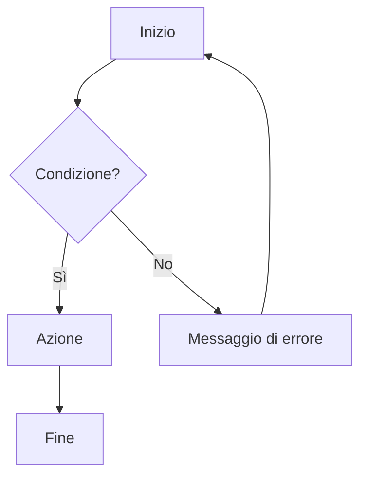
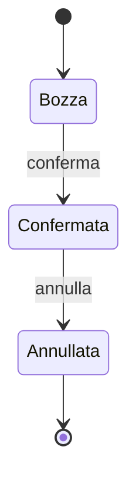

# Sincronizzazione – Flussi

<!-- Fase 2 della guida. I diagrammi si scrivono in Mermaid. -->

## FL-00 – [Titolo]
**Requisito:** RF-00 · **Attori:** [ruoli coinvolti]

### Percorsi alternativi
- 

### Sfighe gestite
| Sfiga | Rilevamento | Comunicazione | Via d'uscita |
|---|---|---|---|
| SF-01 | | | |

### Sfighe considerate e scartate
- SF-00: [motivo]

---

## Diagrammi a stati

### [Entità] – Stati

| Transizione | Chi può attivarla | Regola |
|---|---|---|
| | | |

---

## Regole di business
| Codice | Regola | Usata in |
|---|---|---|
| RB-00 | | FL-00 |
