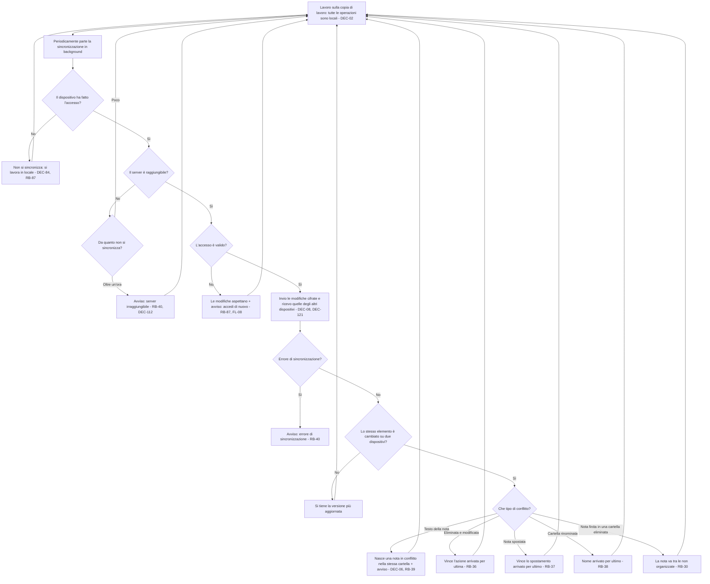
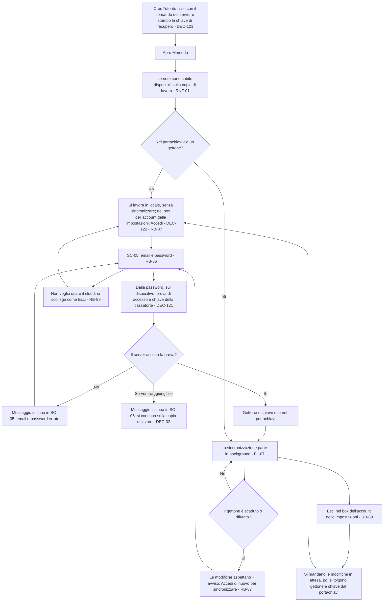

# Sincronizzazione – Flussi

<!-- Fase 2 della guida. I diagrammi si scrivono in Mermaid. -->

## FL-07 – Sincronizzare
**Requisito:** RF-10 · **Attori:** Utente, Sistema (sincronizzazione in background)

```mermaid
flowchart TD
    A[Lavoro sulla copia di lavoro: tutte le operazioni sono locali - DEC-02] --> B[Periodicamente parte la sincronizzazione in background]
    B --> X{Il dispositivo ha fatto l'accesso?}
    X -- No --> Y[Non si sincronizza: si lavora in locale - DEC-84, RB-87]
    Y --> A
    X -- Sì --> C{Il server è raggiungibile?}
    C -- No --> D{Da quanto non si sincronizza?}
    D -- Poco --> A
    D -- Oltre un'ora --> W[Avviso: server irraggiungibile - RB-40, DEC-112]
    W --> A
    C -- Sì --> E{L'accesso è valido?}
    E -- No --> V[Le modifiche aspettano + avviso: accedi di nuovo - RB-87, FL-08]
    V --> A
    E -- Sì --> F[Invio le modifiche cifrate e ricevo quelle degli altri dispositivi - DEC-08, DEC-121]
    F --> G{Errore di sincronizzazione?}
    G -- Sì --> U[Avviso: errore di sincronizzazione - RB-40]
    G -- No --> H{Lo stesso elemento è cambiato su due dispositivi?}
    H -- No --> I[Si tiene la versione più aggiornata]
    H -- Sì --> J{Che tipo di conflitto?}
    J -- Testo della nota --> K[Nasce una nota in conflitto nella stessa cartella + avviso - DEC-06, RB-39]
    J -- Eliminata e modificata --> L[Vince l'azione arrivata per ultima - RB-36]
    J -- Nota spostata --> M[Vince lo spostamento arrivato per ultimo - RB-37]
    J -- Cartella rinominata --> N[Nome arrivato per ultimo - RB-38]
    J -- Nota finita in una cartella eliminata --> O[La nota va tra le non organizzate - RB-30]
    I --> A
    K --> A
    L --> A
    M --> A
    N --> A
    O --> A
```

### Percorsi alternativi
- **Senza rete:** si continua a scrivere; le modifiche partono appena la rete torna (DEC-02).
- **Nessun problema:** la sincronizzazione è invisibile, non c'è nessun indicatore (RB-40).

### Sfighe gestite
| Sfiga | Rilevamento | Comunicazione | Via d'uscita |
|---|---|---|---|
| SF-08 Connessione che cade a metà | La sincronizzazione non si completa | Nessun messaggio, se dura poco | Riprova alla sincronizzazione successiva (DEC-02) |
| SF-20 Riferimenti spariti | Nota creata o spostata in una cartella eliminata altrove | Nessun messaggio | La nota va tra le non organizzate, la cartella resta nel cestino (RB-30) |
| SF-22 Modifica simultanea | Lo stesso elemento cambiato su due dispositivi | Avviso solo per le note in conflitto (RB-39) | DEC-06, RB-36, RB-37, RB-38 |
| SF-25 Accesso revocato | Il server rifiuta il gettone | Avviso «Accedi di nuovo per sincronizzare» (RB-87) | Si accede di nuovo in SC-05 (FL-08); le modifiche partono dopo l'accesso |
| SF-12 Sessione scaduta | Il gettone è scaduto | Come SF-25 (RB-87) | Come SF-25: niente va perso, le modifiche restano sulla copia di lavoro |
| SF-30 Servizio esterno fuori uso | Server irraggiungibile da più di un'ora (DEC-112) | Avviso (RB-40) | Le modifiche restano sulla copia di lavoro finché il server non torna |
| SF-31 Notifiche perse | Un conflitto avviene mentre l'utente non guarda | L'avviso resta finché non lo si chiude o non si chiude la finestra (DEC-90) | La nota in conflitto resta nella cartella, riconoscibile dal titolo (DEC-06) |
| SF-33 Versioni diverse di app e server | Il server non riconosce la versione del protocollo | Avviso: errore di sincronizzazione (RB-40) | Si continua sulla copia di lavoro; si riparte da soli quando le versioni tornano compatibili (DEC-83) |
| SF-32 Errore a metà operazione | Errore durante l'invio o la ricezione | Avviso (RB-40) | Riprova alla sincronizzazione successiva; la copia di lavoro resta intatta |

### Sfighe considerate e scartate
- SF-01 … SF-07: la sincronizzazione non richiede azioni dell'utente.
- SF-34 … SF-36: il contenuto viaggia cifrato end-to-end e il server non lo legge (RNF-02, DEC-121); l'accesso è trattato in FL-08.

---

## FL-08 – Accedere e uscire
**Requisito:** RF-14 · **Attori:** Utente, Sistema

```mermaid
flowchart TD
    A[Creo l'utente fisso con il comando del server e stampo la chiave di recupero - DEC-121] --> C[Apro Memodu]
    C --> D[Le note sono subito disponibili sulla copia di lavoro - RNF-01]
    D --> M{Nel portachiavi c'è un gettone?}
    M -- No --> L[Si lavora in locale, senza sincronizzare; nel box dell'account delle impostazioni: Accedi - DEC-122 - RB-87]
    L --> S[SC-05: email e password - RB-86]
    S --> P[Dalla password, sul dispositivo: prova di accesso e chiave della cassaforte - DEC-121]
    S --> N[Non voglio usare il cloud: si scollega come Esci - RB-89]
    N --> L
    P --> E{Il server accetta la prova?}
    E -- No --> X[Messaggio in linea in SC-05: email o password errate]
    X --> S
    E -- Server irraggiungibile --> R[Messaggio in linea in SC-05; si continua sulla copia di lavoro - DEC-02]
    E -- Sì --> K[Gettone e chiave dati nel portachiavi]
    K --> F[La sincronizzazione parte in background - FL-07]
    M -- Sì --> F
    F --> T{Il gettone è scaduto o rifiutato?}
    T -- No --> F
    T -- Sì --> V[Le modifiche aspettano + avviso: Accedi di nuovo per sincronizzare - RB-87]
    V --> S
    F --> U[Esci nel box dell'account delle impostazioni - RB-89]
    U --> W[Si mandano le modifiche in attesa, poi si tolgono gettone e chiave dal portachiavi]
    W --> L
```

### Percorsi alternativi
- **Mai fatto l'accesso:** si lavora in locale sulla copia di lavoro, senza sincronizzare e senza blocco (DEC-84, RB-87).
- **Gettone scaduto o rifiutato:** non si blocca niente: si continua a scrivere, le modifiche aspettano e l'avviso porta a SC-05; dopo l'accesso si sincronizza tutto (RB-87). Vale anche per la nota rapida.
- **Gettone vicino alla scadenza:** quando mancano meno di 7 giorni l'app lo rinnova da sola, senza chiedere nulla (RB-86).
- **Server irraggiungibile:** non blocca; si lavora sulla copia di lavoro (DEC-02, RB-40).
- **Password persa:** con la chiave di recupero se ne sceglie una nuova; per ora rilanciando il comando del server (RB-90, runbook).
- **Dispositivo perso:** per ora si cambia il segreto dei gettoni e tutti i dispositivi rifanno l'accesso (DEC-121, runbook).
- **Uscire:** «Esci» manda le modifiche in attesa, poi scollega; la copia di lavoro resta (RB-89).
- **Non voglio usare il cloud:** in SC-05 scollega come «Esci»; con il gettone scaduto le modifiche in attesa restano sulla copia di lavoro e l'avviso non torna (RB-89).

### Sfighe gestite
| Sfiga | Rilevamento | Comunicazione | Via d'uscita |
|---|---|---|---|
| SF-07 Dimenticanze | Password dimenticata | Messaggio in linea in SC-05 per le credenziali errate | Chiave di recupero (RB-90) |
| SF-12 Sessione scaduta | Gettone scaduto | Avviso «Accedi di nuovo per sincronizzare» (RB-87) | Si accede di nuovo; le modifiche restano sulla copia di lavoro |
| SF-25 Accesso revocato | Il server rifiuta il gettone (segreto cambiato) | Come SF-12 | Come SF-12 |
| SF-35 Tentativi ripetuti | Molte prove sbagliate | Nessuna, per ora | Nessun limite ai tentativi, rinviato (rischio in `avanzamento.md`); ogni prova costa un calcolo Argon2id e la password ha almeno 12 caratteri (RB-88) |

### Sfighe considerate e scartate
- SF-01 Doppio invio: accedere due volte non crea nulla di diverso.
- SF-19 Duplicati, SF-27 Account non verificato: un solo utente, creato dal comando del server, senza registrazione (DEC-13, DEC-121).
- SF-26 Accesso via link diretto: il web è rinviato (ID-19).
- SF-36 Input malevolo: email e password non vengono eseguite né mostrate (RB-08).
- Le altre sfighe non riguardano l'accesso.

---

## Regole di business
| Codice | Regola | Usata in |
|---|---|---|
| RB-36 | Se una nota è stata eliminata su un dispositivo e modificata su un altro, vince l'azione arrivata per ultima al server (DEC-109): se è la modifica, la nota esce dal cestino con le modifiche; se è l'eliminazione, la nota resta nel cestino con le modifiche comprese | FL-07 |
| RB-37 | Se una nota è stata spostata in cartelle diverse su due dispositivi, resta nella cartella dello spostamento arrivato per ultimo al server (DEC-109) | FL-07 |
| RB-38 | Se una cartella è stata rinominata in modo diverso su due dispositivi, prende il nome arrivato per ultimo al server (DEC-109), senza cartella vuota con l'altro (DEC-110) | FL-07 |
| RB-39 | Quando nasce una nota in conflitto (DEC-06) compare un avviso con il collegamento alla nota. La nota in conflitto ha lo stesso titolo seguito da "(copia in conflitto)" | FL-07 |
| RB-40 | La sincronizzazione è invisibile finché va tutto bene. Compare un avviso solo per: errore di sincronizzazione (subito), server irraggiungibile per più di un'ora dall'ultima sincronizzazione riuscita (DEC-112) | FL-07 |
| RB-41 | ~~Uscendo (logout), le modifiche in attesa vengono sincronizzate e poi la copia di lavoro su quel dispositivo viene cancellata~~ Superata da DEC-13 | — |
| RB-42 | ~~Non c'è limite ai tentativi di accesso con password sbagliata (rischio accettato, DEC-07)~~ Superata da DEC-13 | — |
| RB-43 | ~~La password non ha requisiti di lunghezza o complessità (rischio accettato, DEC-07)~~ Superata da DEC-13 | — |
| RB-44 | ~~Se all'uscita ci sono modifiche non sincronizzate, l'uscita avviene subito ma la copia di lavoro resta, cifrata e illeggibile senza password, finché le modifiche non si sincronizzano; poi si cancella. Sul web la sincronizzazione può riprendere solo quando Memodu viene riaperto in quel browser~~ Superata da DEC-13 | — |
| RB-50 | ~~Email e password si cambiano dalle impostazioni inserendo la password attuale. Cambiando password le note vengono ricifrate e gli altri dispositivi devono accedere di nuovo~~ Superata da DEC-13 | — |
| RB-51 | Il nome di un dispositivo viene preso dal sistema (es. nome del PC) e si può cambiare dalle impostazioni | FL-07, FL-08 |
| RB-53 | ~~Gli avvisi si sincronizzano: compaiono su tutti i dispositivi e, visti su uno, non si mostrano più su nessuno~~ Superata da DEC-90: gli avvisi restano sul dispositivo in cui nascono | — |
| RB-54 | ~~Un dispositivo si collega all'installazione con le credenziali scritte nel file di configurazione dell'app all'installazione: non ci sono login, email, password né uscita (DEC-13)~~ Superata da DEC-121 | — |
| RB-57 | ~~Con credenziali rifiutate dal server la finestra principale e la nota rapida non si aprono: al loro posto c'è la schermata di blocco con Riprova, che rilegge la configurazione. Il server irraggiungibile non blocca (DEC-02); senza il file delle credenziali si lavora in locale senza sincronizzare (DEC-84). Quello che era scritto resta sulla copia di lavoro (DEC-20)~~ Superata da DEC-121: vedi RB-87 | — |
| RB-86 | Si accede in SC-05 con email e password dell'utente fisso (DEC-121). Dalla password, sul dispositivo, si ricavano la prova di accesso per il server e la chiave che apre la chiave dati; il server restituisce un gettone di 30 giorni, che l'app rinnova da sola quando ne mancano meno di 7. Gettone e chiave dati restano nel portachiavi del sistema | FL-08 |
| RB-87 | Senza un gettone valido la finestra non si blocca mai. Mai fatto l'accesso: si lavora in locale e il box dell'account delle impostazioni dice «Non hai fatto l'accesso» con Accedi (DEC-122). Gettone scaduto o rifiutato: si continua a scrivere, le modifiche aspettano e l'avviso «Accedi di nuovo per sincronizzare» apre SC-05; dopo l'accesso si sincronizza tutto (DEC-121) | FL-07, FL-08 |
| RB-88 | La password ha almeno 12 caratteri, nessuna regola di complessità e non può essere tra le più comuni (elenco breve nel programma). La controlla il comando che crea l'utente (DEC-121) | FL-08 |
| RB-89 | «Esci», nel box dell'account delle impostazioni (SC-06, DEC-122), manda le modifiche in attesa e poi toglie gettone e chiave dati dal portachiavi: il dispositivo lavora in locale senza sincronizzare. La copia di lavoro resta (DEC-121). «Non voglio usare il cloud» in SC-05 fa lo stesso (scelta di Manuel Cucca il 06/10/2026): se il gettone non vale più, le modifiche in attesa restano sulla copia di lavoro e partono al prossimo accesso; l'avviso «Accedi di nuovo» non torna | FL-08 |
| RB-90 | Creando l'utente nasce una chiave di recupero, mostrata una volta per stamparla: con questa si sceglie una password nuova senza perdere le note. Persi la password e la chiave di recupero, le note sul server non si recuperano (DEC-121) | FL-08 |
