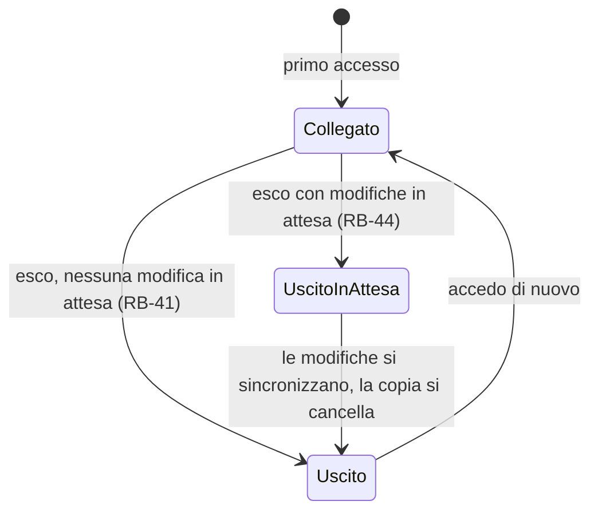

# Sincronizzazione – Entità

<!-- Fase 3 della guida. -->

## Diagramma ER
Il diagramma di tutto il sistema è in `moduli/note/3-entita.md`.

## EN-05 – Account
**Descrizione:** l'unico account dell'installazione personale (RF-14, DEC-05).

| Attributo | Tipo | Obbligatorio | Vincoli | Note |
|---|---|---|---|---|
| Identificativo | Codice | Sì | Uno solo per installazione (DEC-01, DEC-05) | Tecnico, non visibile |
| Email | Email | Sì | | Modificabile (RB-50) |
| Password | Segreto | Sì | Nessun requisito (RB-43) | Modificabile (RB-50). Protegge accesso e cifratura: non si salva mai in chiaro; come se ne ricava la chiave si decide in Fase 7 |
| Data di creazione | Data e ora | Sì | | Alla prima installazione |

- **Chi lo crea:** l'utente, alla prima installazione (FL-08).
- **Chi lo modifica:** l'utente, dalle impostazioni, inserendo la password attuale (RB-50).
- **Cancellazione:** non prevista nella prima fase.
- **Dati sensibili:** email e password. La password non si conserva mai in chiaro. Quali dati dell'account il server deve poter leggere per verificare l'accesso si decide in Fase 7. Il recupero della password è rimandato (domanda aperta su RF-10).

## EN-06 – Dispositivo
**Descrizione:** un computer o un browser da cui l'utente accede a Memodu (FL-07, FL-08).

| Attributo | Tipo | Obbligatorio | Vincoli | Note |
|---|---|---|---|---|
| Identificativo | Codice | Sì | Unico e stabile | Tecnico, non visibile |
| Nome | Testo | Sì | | Preso dal sistema (es. nome del PC, "Chrome su Windows"), modificabile (RB-51). Compare nel titolo delle note in conflitto (DEC-06) |
| Tipo | Windows \| macOS \| web | Sì | Piattaforme della prima fase (DEC-04) | |
| Stato | collegato \| uscito in attesa \| uscito | Sì | | "Uscito in attesa": la copia di lavoro resta cifrata finché le modifiche non si sincronizzano (RB-44) |
| Ultima sincronizzazione | Data e ora | No | | Serve all'avviso di RB-40 |
| Modifiche in attesa | Numero | Sì | | Modifiche non ancora arrivate al server |

- **Chi lo crea:** il sistema, al primo accesso da quel dispositivo (FL-08).
- **Chi lo modifica:** il sistema; l'utente, solo per il nome (RB-51).
- **Cancellazione:** uscendo, la copia di lavoro sul dispositivo si cancella (RB-41, RB-44). Se il dispositivo uscito resti registrato si decide con RF-16 (Should).
- **Dati sensibili:** il nome del dispositivo è cifrato end-to-end (DEC-08).

## EN-08 – Avviso
**Descrizione:** un avviso mostrato all'utente dalla sincronizzazione (RB-39, RB-40). Si sincronizza: visto su un dispositivo, sparisce da tutti (RB-53).

| Attributo | Tipo | Obbligatorio | Vincoli | Note |
|---|---|---|---|---|
| Identificativo | Codice | Sì | Unico e stabile | Tecnico, non visibile |
| Tipo | nota in conflitto \| errore di sincronizzazione \| accesso non valido \| server irraggiungibile | Sì | | RB-39, RB-40 |
| Nota collegata | EN-01 | No | Solo per il tipo "nota in conflitto" | Il collegamento dell'avviso (RB-39) |
| Dispositivo | EN-06 | Sì | | Il dispositivo su cui è nato il problema |
| Data | Data e ora | Sì | | |
| Visto | Sì \| No | Sì | | Di default No |

Il testo dell'avviso non è un attributo: dipende dal tipo e si scrive in Fase 6.

- **Chi lo crea:** il sistema (FL-07).
- **Chi lo modifica:** l'utente, vedendolo (Visto diventa Sì).
- **Cancellazione:** un avviso visto non si mostra più, su nessun dispositivo (RB-53). Quando eliminarlo davvero si decide in Fase 7.
- **Dati sensibili:** cifrato end-to-end come tutti i dati (DEC-08).
- **Limite:** un avviso "server irraggiungibile" per natura non può sincronizzarsi finché il server non torna: fino ad allora esiste solo sul dispositivo che lo ha generato.

## Diagrammi a stati

### Dispositivo – Stato

| Transizione | Chi può attivarla | Regola |
|---|---|---|
| Esco | Utente | RB-41, RB-44 |
| Sincronizzazione completata | Sistema | RB-44 |
| Accedo di nuovo | Utente | FL-08 |
