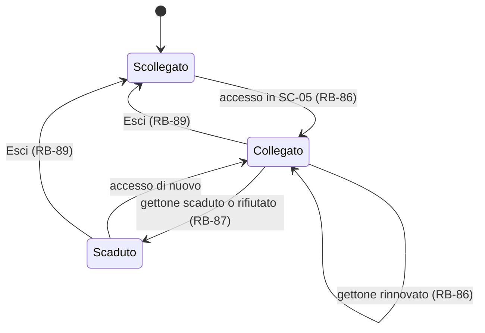

# Sincronizzazione – Entità

<!-- Fase 3 della guida. -->

## Diagramma ER
Il diagramma di tutto il sistema è in `moduli/note/3-entita.md`.

## EN-05 – Account
**Descrizione:** l'unico utente dell'installazione personale (RF-14, DEC-13, DEC-121). Per ora è fisso: i suoi dati stanno nelle variabili d'ambiente del server, generati da un comando, e non in una tabella.

| Attributo | Tipo | Obbligatorio | Vincoli | Note |
|---|---|---|---|---|
| Email | Testo | Sì | Una sola per installazione (DEC-01, DEC-13) | Serve ad accedere (RB-86) |
| Sale e parametri di Argon2id | Tecnico | Sì | Sale casuale; 64 MiB, 3 passaggi, 1 filo (DEC-121) | Il server li dà prima dell'accesso; i parametri si possono alzare |
| Impronta della prova di accesso | Tecnico | Sì | SHA-256 | La prova si ricava dalla password sul dispositivo; il server non vede mai la password |
| Impronta della prova di recupero | Tecnico | Sì | SHA-256 | La prova si ricava dalla chiave di recupero (RB-90) |
| Chiave dati avvolta con la password | Segreto | Sì | | La chiave che cifra le note, illeggibile senza la password (DEC-08, DEC-121) |
| Chiave dati avvolta con la chiave di recupero | Segreto | Sì | | La stessa chiave dati, per scegliere una password nuova (RB-90) |
| Data di creazione | Data e ora | Sì | | Quando il comando crea l'utente |

La password e la chiave di recupero non sono attributi: non lasciano il dispositivo e il foglio stampato. Il segreto che firma i gettoni appartiene al server, non all'utente.

- **Chi lo crea:** Manuel Cucca, con il comando del server che crea l'utente fisso (DEC-121); l'app non crea account.
- **Chi lo modifica:** per ora nessuno dall'app: per cambiare password si rilancia il comando con la chiave di recupero, che riusa la stessa chiave dati (RB-90).
- **Cancellazione:** non prevista nella prima fase.
- **Dati sensibili:** tutti; con questi dati il server non legge le note (DEC-121). Rischi: chi trova il foglio con la chiave di recupero legge tutte le note; persi password e chiave di recupero, le note sul server non si recuperano.

## EN-06 – Dispositivo
**Descrizione:** un computer da cui l'utente usa Memodu (FL-07, FL-08).

| Attributo | Tipo | Obbligatorio | Vincoli | Note |
|---|---|---|---|---|
| Identificativo | Codice | Sì | Unico e stabile | Tecnico, non visibile |
| Nome | Testo | Sì | | Preso dal sistema (es. nome del PC), modificabile (RB-51). Vale solo su questo dispositivo (RB-52) |
| Tipo | Windows \| macOS | Sì | Piattaforme della prima fase (DEC-13) | |
| Ultima sincronizzazione | Data e ora | No | | Serve all'avviso di RB-40 |
| Modifiche in attesa | Numero | Sì | | Modifiche non ancora arrivate al server |
| Gettone e chiave dati | Segreto | No | Nel portachiavi del sistema, mai nella copia di lavoro | Ci sono dopo l'accesso, spariscono uscendo (RB-86, RB-89) |

- **Chi lo crea:** il sistema, alla prima sincronizzazione da quel dispositivo (FL-08).
- **Chi lo modifica:** il sistema; l'utente, solo per il nome (RB-51).
- **Cancellazione:** «Esci» scollega il dispositivo e la copia di lavoro resta (RB-89). Se resti registrato si decide con RF-16 (Should).
- **Dati sensibili:** il nome del dispositivo è cifrato end-to-end (DEC-08).

## EN-08 – Avviso
**Descrizione:** un avviso mostrato all'utente dalla sincronizzazione (RB-39, RB-40). Vive nella finestra del dispositivo in cui nasce: non si sincronizza e non si conserva, chiusa la finestra sparisce (DEC-90).

| Attributo | Tipo | Obbligatorio | Vincoli | Note |
|---|---|---|---|---|
| Identificativo | Codice | Sì | Unico e stabile | Tecnico, non visibile |
| Tipo | nota in conflitto \| errore di sincronizzazione \| server irraggiungibile \| accesso scaduto | Sì | | RB-39, RB-40, RB-87 |
| Nota collegata | EN-01 | No | Solo per il tipo "nota in conflitto" | Il collegamento dell'avviso (RB-39) |
| Dispositivo | EN-06 | Sì | | Il dispositivo su cui è nato il problema |
| Data | Data e ora | Sì | | |

Il testo dell'avviso non è un attributo: dipende dal tipo e si scrive in Fase 6.

- **Chi lo crea:** il sistema (FL-07).
- **Chi lo modifica:** nessuno; l'utente lo chiude.
- **Cancellazione:** sparisce quando l'utente lo chiude o quando si chiude la finestra (DEC-90).
- **Dati sensibili:** non lascia il dispositivo (DEC-90).

## Diagrammi a stati
EN-06 Dispositivo, rispetto all'accesso (DEC-121):

```mermaid
stateDiagram-v2
    [*] --> Scollegato
    Scollegato --> Collegato: accesso in SC-05 (RB-86)
    Collegato --> Collegato: gettone rinnovato (RB-86)
    Collegato --> Scaduto: gettone scaduto o rifiutato (RB-87)
    Scaduto --> Collegato: accesso di nuovo
    Collegato --> Scollegato: Esci (RB-89)
    Scaduto --> Scollegato: Esci (RB-89)
```

In tutti gli stati si lavora sulla copia di lavoro; si sincronizza solo da Collegato.
